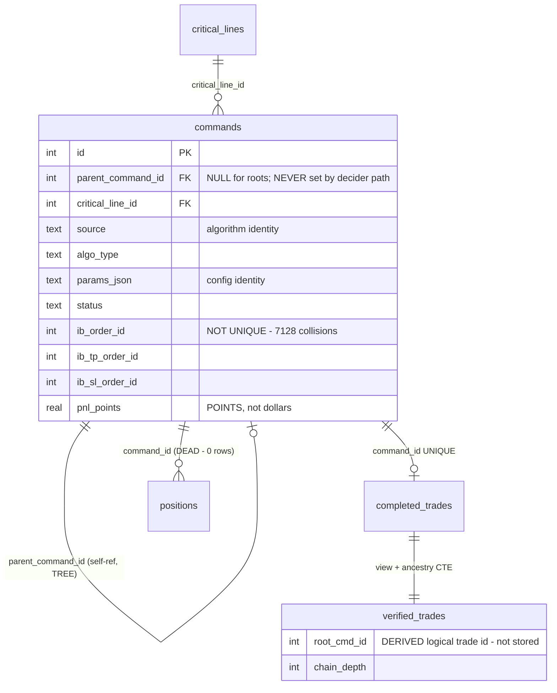
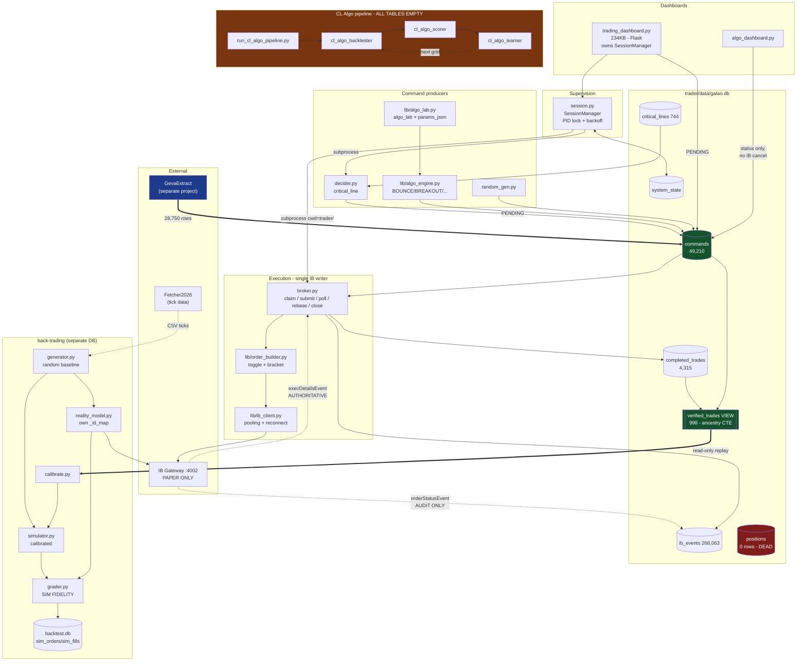
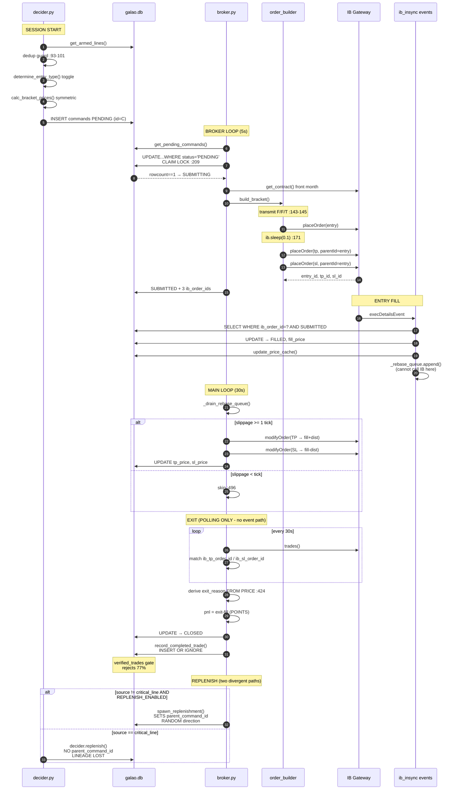
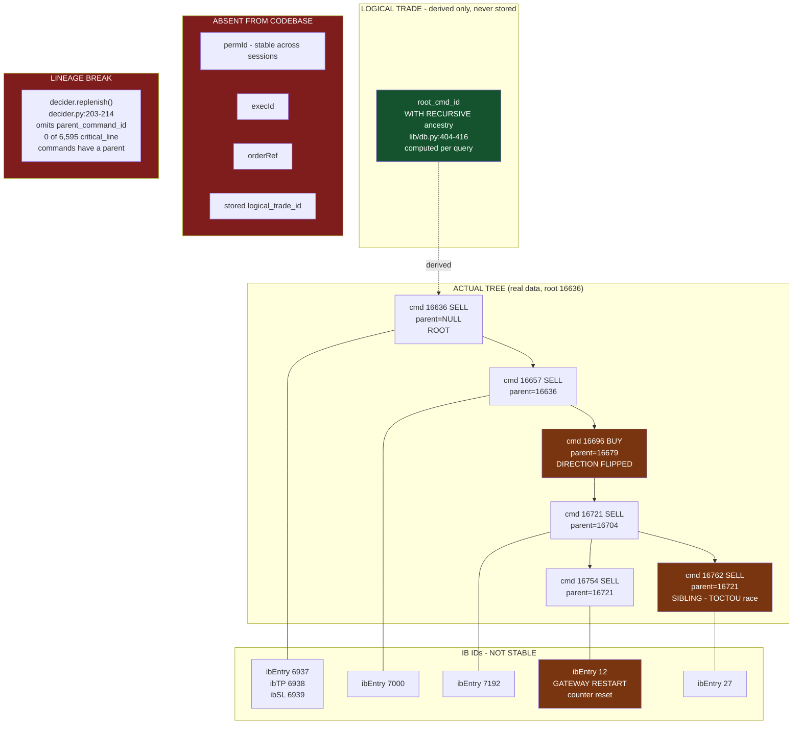
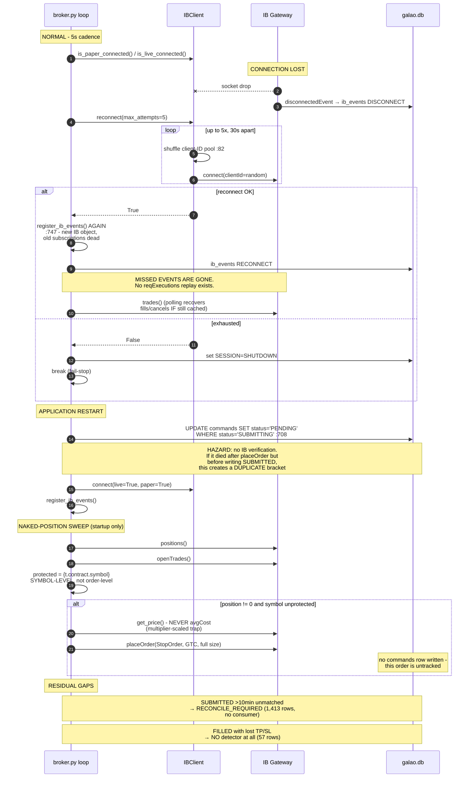

# BACK_TRADING_INTEGRATION_REPORT

**Forensic inventory of CriticalCorallations2026 — execution, tracking, persistence, and experiment infrastructure.**

Prepared: 2026-08-22
Repository: `C:\Projects\CriticalCorallations2026` (remote `cc2026`)
Method: source tracing + live-database interrogation. No code was modified.

**Reading rules for this document**

- Every factual claim carries a `file:line` citation. Claims derived from querying the live database are marked **[DB]** and show the query result.
- Where the code is ambiguous or I could not confirm behaviour, it says **UNCONFIRMED** explicitly. I did not guess.
- Docstrings and the repo's own `.md` files were used **only** to locate code. Where a docstring contradicts the code, the code is reported and the contradiction is flagged.
- `june/` was excluded after confirming nothing live references it. `versions/` and `back-trading/versions/` are frozen snapshots, also excluded.

---

## 1. Executive summary

### 1.1 What this system actually is

A single-symbol-oriented, **paper-only** futures bracket-trading system built around one SQLite table (`commands`) that acts as a work queue. Independent "producer" modules write `PENDING` rows; one consumer (`trader/broker.py`) submits them to Interactive Brokers as three-leg bracket orders, tracks fills, and writes terminal state back.

**There is no live-money trading path in this repository.** `trader/config.yaml:7` sets `live_port: 4002` and `trader/config.yaml:10` sets `paper_port: 4002` — the same port, with the inline comment "single paper gateway — handles both data and orders". The `IBClient` LIVE/PAPER split (`lib/ib_client.py:36-40`) is a *data vs. orders* separation, not a *real vs. paper money* separation. Section 4 traces a paper trade; a real-money trade has never been placed by this code as configured.

### 1.2 The single most important finding

**There is no logical-trade identity in the database.** No column anywhere stores a logical trade ID.

What the user has been calling "the logical trade" is a **derived** value: `root_cmd_id`, computed on the fly by a `WITH RECURSIVE` CTE inside the `verified_trades` **view** (`lib/db.py:402-478`, specifically the `ancestry` CTE at `lib/db.py:404-416`). It is materialised nowhere, indexed nowhere, and written by nothing. The only durable identity in the system is `commands.id` (`lib/db.py:65`).

Three consequences, all confirmed against the live DB, are detailed in §5 and §6:

1. The lineage is a **tree, not a chain** — 786 parents have more than one child **[DB]**, created in the same second by a check-then-insert race (§6.4).
2. `parent_command_id` is set by **only one of the two** replenishment code paths. The other path — the one that handles the entire `critical_line` source — silently drops the link. **0 of 6,595 `critical_line` commands have a parent** **[DB]** (§6.2).
3. A "replenishment" is **not a continuation of the same trade**. `lib/db.py:721` picks its direction with `random.choice(["BUY", "SELL"])`. The child may be the opposite side of the market from its parent (§6.3).

### 1.3 What is genuinely worth preserving

The infrastructure that has been hardened by real incidents and is correct as written:

- The **claim lock** (`trader/broker.py:209-223`) — atomic `PENDING → SUBMITTING` transition, correctly implemented.
- The **exactly-once completed-trade write** (`lib/db.py:662-688`) — `INSERT OR IGNORE` on a `UNIQUE` column.
- The **`verified_trades` quality gate** (`lib/db.py:456-477`) — seven arithmetic and sanity filters that reject bad rows. It rejects 77% of `completed_trades` **[DB]**.
- **Price-derived exit reasons** (`trader/broker.py:424-435` and `lib/db.py:433-439`) — deliberately immune to order-ID mislabelling.
- **Naked-position reconciliation** (`trader/broker.py:625-691`) — with a hard-won comment about futures `avgCost` multiplier scaling.
- The **`commands`-table producer/consumer seam** — already algorithm-independent (§17).

### 1.4 What is missing or broken

- **No `permId`, no `execId`, no `reqExecutions`, no `reqAllOpenOrders`** anywhere in the codebase **[DB/grep]**. The system has no stable broker-side identity and cannot replay what it missed while disconnected (§9).
- `ib_order_id` **is not unique** — 7,128 distinct values are shared by two or more commands **[DB]** (§5.3).
- Two schema states (`EXITING`) and one terminal state (`RECONCILE_REQUIRED`, 1,413 rows) are **written but never consumed** (§10.4).
- The `positions` table is **written by no live code** and holds 0 rows **[DB]** (§10.3).
- Simulated and real results use **different schemas, different field names, and different P&L units** (points vs. dollars) — they cannot currently be compared without hand-written translation (§13).

---

## 2. Repository map

### 2.1 Top-level layout

| Path | Role | Live? |
|---|---|---|
| `trader/` | Live execution: broker, decider, session supervisor | **Yes** |
| `lib/` | Shared library: DB, IB client, order building, algo engine | **Yes** |
| `back-trading/` | Dashboard + simulation/calibration + CL Algo pipeline | **Partly** |
| `data/` | Root-level CSVs and an **empty** `galao.db` | No (stale) |
| `trader/data/` | **The live database** + bars | **Yes** |
| `june/` | Older parallel snapshot | **No** |
| `versions/`, `back-trading/versions/` | Frozen iteration snapshots | No |
| `algo-analyzer/`, `docs/`, `scripts/`, `tests_gui/` | Auxiliary | Peripheral |

### 2.2 Which database is live — resolved, not assumed

`trader/config.yaml:67` declares `paths.db: data/galao.db` — a **relative** path. Resolution therefore depends on the working directory of whichever process opens it.

`trader/session.py:207` spawns children with `cwd=str(self._trader_dir)`, and `self._trader_dir` defaults to `Path(__file__).parent` (`trader/session.py:85`) — i.e. `trader/`. So `broker.py` and `decider.py` resolve `data/galao.db` to **`trader/data/galao.db`**.

Three independent confirmations:

1. **[DB]** `trader/data/galao.db` holds 49,210 `commands`, 4,315 `completed_trades`, 268,063 `ib_events`. Root `data/galao.db` holds **0 rows in every table** — it is empty scaffolding created by a stray `init_db()` call.
2. `back-trading/config.yaml:70` hard-codes `live_db: ../trader/data/galao.db` with the comment "live paper trading DB".
3. `back-trading/trading_dashboard.py:122-135` (`_resolve_db()`) explicitly resolves the relative path against `trader/config.yaml`'s own directory, falling back to `_ROOT/"trader"/"data"/"galao.db"`.

> **Fragility worth recording.** The relative `paths.db` is only correct because of the `cwd=` argument at `trader/session.py:207`. Any process that imports `lib.db` and calls `get_db()` from a different working directory silently creates or opens a **different, empty** database — which is exactly how the root-level `data/galao.db` came to exist. `lib/db.py:32-40` (`_resolve_path()`) has a bare `except Exception: return Path("data/galao.db")` fallback that makes this failure silent.

### 2.3 Component inventory

#### Live execution path

| File | Key functions | Purpose | Inputs | Outputs | Depends on |
|---|---|---|---|---|---|
| `trader/broker.py` (935 L) | `run_broker():694`, `process_pending_commands():226`, `poll_fills():286`, `poll_tp_sl_fills():375`, `_drain_rebase_queue():456`, `replenish_if_enabled():573`, `reconcile_naked_positions():625`, `register_ib_events():104`, `_claim_command():209` | Sole IB order submitter and fill tracker | `commands` rows with `status='PENDING'`; IB events | Order status, fills, `completed_trades`, `ib_events`, `price_cache` | `lib.db`, `lib.ib_client`, `lib.order_builder` |
| `trader/decider.py` (425 L) | `generate_commands():67`, `replenish():145`, `run_session_start():226`, `run_replenishment_loop():257` | Turns armed critical lines into `PENDING` commands; replenishes on fill | `critical_lines`, live price | `commands` rows | `lib.db`, `lib.order_builder`, `lib.critical_lines` |
| `trader/session.py` (~500 L) | `SessionManager.start():128`, `.stop():153`, `_spawn():196`, `_monitor_loop():213`, `_acquire_pid_lock():288` | Supervises broker + decider as subprocesses, restart-with-backoff | Config | Subprocesses, `system_state.SESSION` | `subprocess`, `lib.db` |
| `lib/db.py` (46 KB) | `get_db():44`, `init_db():394`, `spawn_replenishment():712`, `record_completed_trade():662`, `update_command_status():653`, `_root_critical_line_id():691` | Schema, migrations, all CRUD | — | SQLite | `sqlite3` |
| `lib/ib_client.py` (15 KB) | `IBClient.connect():70`, `reconnect():120`, `get_price():146`, `get_contract():199`, `get_positions():254` | IB connection pooling, contract resolution, pricing | Config | `ib_insync.IB` handles | `ib_insync` |
| `lib/order_builder.py` (12 KB) | `determine_entry_type():38`, `calc_bracket_prices():66`, `build_bracket():107`, `place_bracket():153`, `round_tick():33` | Toggle rule + bracket construction/placement | direction, prices | IB `Order`/`Trade` objects | `ib_insync` |
| `lib/config_loader.py` | `get_config()` | YAML → attribute object | `config.yaml` | Config object | `yaml` |
| `lib/logger.py` | `get_logger()` | Per-component file logging | — | Log files | — |

#### Strategy / command producers (all write to the same `commands` table)

| File | Key functions | What it produces | `source` tag |
|---|---|---|---|
| `trader/decider.py` | `generate_commands():67` | Bracket commands from armed critical lines | `critical_line` |
| `lib/algo_engine.py` (17.8 KB) | `AlgoType:39`, `AlgoParams:76`, `_pairs_for_line():148`, `generate_cl_commands():244` | Strategy-typed commands (BOUNCE/BREAKOUT/DIRECTIONAL/FADE/BOTH) | caller-supplied |
| `lib/algo_lab.py` (15 KB) | `build_param_grid():43`, `submit_grid():137`, `combo_params_json():78` | Parameter-grid sweeps, tagged with `params_json` | `algo_lab` |
| `back-trading/trading_dashboard.py` | `api_trades_create():1022`, `api_trades_submit():1103` | Manually reviewed candidates | `trading_dashboard` |
| *(external project GevaExtract)* | — writes directly into this DB | 28,750 commands **[DB]** | `geva_extract` |
| `trader/random_gen.py` | — | Random baseline trades | `random_mkt/lmt/stp` |
| `trader/tracer.py` | `insert_test_commands():145` | Manual GUI test trades | `test` |

#### Analysis / attribution

| File | Key functions | Purpose |
|---|---|---|
| `lib/algo_pnl.py` (11.6 KB) | `get_breakdown():41`, `rollup_by_source():127` | P&L attribution by `(symbol, source, algo_type, params_json)` — reads `verified_trades` |
| `lib/critical_lines.py` | `get_armed_lines()`, `disarm_line()`, `rearm_line()` | Critical-line CRUD |
| `lib/price_profile.py`, `lib/correlation_lab.py`, `lib/day_params.py`, `lib/data_availability.py` | — | Read-only research helpers |

#### Back-trading (simulation + calibration)

| File | Key functions | Purpose |
|---|---|---|
| `back-trading/engine.py` (16 KB) | `run_day():160`, `run():288` | Orchestrates generate → simulate → (optionally) reality-model → grade |
| `back-trading/generator.py` (11 KB) | `generate():64`, `make_orders_for_price():184` | Synthetic bracket orders at random timestamps (§12) |
| `back-trading/simulator.py` (19.5 KB) | `simulate():167`, `simulate_exit():49`, `_sim_one():190` | Tick-by-tick OCO bracket fill model (§13) |
| `back-trading/reality_model.py` (10.5 KB) | `RealityModel:40`, `run()`, `_on_fill()` | Submits the *same* generated orders to IB paper for comparison |
| `back-trading/grader.py` (5 KB) | `grade():25` | **Simulator-fidelity** scoring, sim vs. paper (§14) |
| `back-trading/calibrate.py` (15 KB) | `calibrate():84` | Replays `verified_trades` through `simulate_exit()` to tune the simulator (§14) |
| `back-trading/db.py` (7 KB) | `init_db():27` | **Separate** backtest schema: `runs`, `sim_orders`, `sim_fills`, `paper_fills`, `grades`, `calib_runs`, `calib_details` |

#### CL Algo pipeline (a genuine, self-contained feedback loop — §14.3)

| File | Key functions | Purpose |
|---|---|---|
| `back-trading/run_cl_algo_pipeline.py` (11 KB) | `run_pipeline():61` | 5-stage orchestrator |
| `back-trading/cl_algo_backtester.py` (25 KB) | `run():200`, `build_combos():174` | Cartesian TP/SL combo simulation |
| `back-trading/cl_algo_full_duplex.py` (24 KB) | `run():195`, `_find_tp_line():154` | Structural exits at the *next critical line* rather than fixed TP |
| `back-trading/cl_algo_scorer.py` (17 KB) | `score():129`, `_compute_metrics():56`, `_has_stable_neighbor():94` | Aggregates sims → ranked combos with composite score |
| `back-trading/cl_algo_learner.py` (19 KB) | `recommend():155`, `_hot_zone():116`, `_fine_grid_around():123`, `_check_convergence():89` | Proposes the next parameter grid |
| `back-trading/cl_algo_worker.py` (10 KB) | `run_worker():79`, `_acquire_lock():37` | Per-symbol worker with a file lock |

#### Dashboards

| File | Purpose |
|---|---|
| `back-trading/trading_dashboard.py` (234 KB) | Main Flask UI. Owns the `SessionManager` (`:31`, `:486-501`), line management, Algo Lab, correlation, P&L views. **Does not talk to IB for order submission** (`:1184` comment, confirmed by absence of `placeOrder` in the file). |
| `back-trading/algo_dashboard.py` (53 KB) | Separate algo-experiment UI; can bulk-cancel commands (`:892`, `:913`, `:965`) |
| `trader/visualizer/app.py` (119 KB) | Older trader-side visualiser |

#### Confirmed dead or legacy in the live path

| File | Evidence |
|---|---|
| `trader/position_manager.py` | Not in `_COMPONENTS` (`trader/session.py:46` — only `("broker", "decider")`). Only spawned by `trader/daily_paper_session.py:356`, itself legacy. Despite its name it **only** disarms/re-arms critical lines on SL cooldown (`:54-102`) — it manages no positions. |
| `trader/tracer.py` | Manual Tkinter test GUI (`run_gui():333`). The **only** writer of `INSERT INTO positions` (`:265`). |
| `trader/daily_paper_session.py`, `trader/may_scheduler.py`, `trader/runner.py` | Superseded by `session.py` + dashboard. `runner.py` is not referenced by the dashboard. |
| `trader/preflight.py` | Defines `run_preflight():118` but no live caller found; `runner.py` referenced it. **UNCONFIRMED** whether the dashboard invokes it — grep found no call site. |
| `trader/create_presentation.py` | Slide generator. **Its schema descriptions are stale** — `:872` documents an `is_replenishment` column that does not exist (§6.1). |

---

## 3. Current architecture

### 3.1 Process topology

```
trading_dashboard.py  (Flask, user-facing, long-running)
  └── imports trader.session.get_session_manager()      [trading_dashboard.py:31]
        └── SessionManager.start()                       [session.py:128]
              ├── subprocess: python broker.py           [session.py:92,  cwd=trader/]
              └── subprocess: python decider.py --mode session
                                                         [session.py:93,  cwd=trader/]
```

`SessionManager._monitor_loop()` (`session.py:213-258`) polls every `monitor_poll_seconds` (5 s, `config.yaml:35`), restarts crashed children with exponential backoff (base 5 s, cap 60 s, max 5 restarts — `config.yaml:36-38`), and distinguishes an intentional shutdown from a crash by reading `system_state.SESSION` (`session.py:230`).

A PID lock file (`session.py:288-299`, `logs/session.pid`) prevents two supervisors. `_pid_alive()` (`session.py:53-68`) uses `OpenProcess` on Windows to detect a stale lock.

### 3.2 The central design pattern: the `commands` table as a work queue

This is the system's single most important architectural property, and the reason §17 concludes execution is already largely algorithm-independent.

```
PRODUCERS (write status='PENDING')          CONSUMER (source-agnostic)
  decider.py       source='critical_line'
  algo_lab.py      source='algo_lab'         ┌──────────────────┐
  dashboard        source='trading_dashboard' →  commands table  → broker.py
  GevaExtract      source='geva_extract'     └──────────────────┘   (single
  random_gen.py    source='random_*'                                 IB writer)
  tracer.py        source='test'
```

`broker.py` never inspects `source` when submitting. `process_pending_commands()` (`broker.py:226-283`) reads only `direction`, `entry_type`, `entry_price`, `tp_price`, `sl_price`, `quantity`, `symbol` (`broker.py:254-262`). `lib/algo_lab.py:20` states this explicitly: "trader/broker.py is source-agnostic and picks them up from whatever paper..." — and the code confirms it.

`source` is consulted in exactly two places, both *outside* submission:
- `broker.replenish_if_enabled()` at `broker.py:589` — `AND c.source != 'critical_line'` (the partition described in §6.2).
- `lib/algo_pnl.py:41` — attribution grouping.

### 3.3 State machine (as actually implemented)

```
PENDING ──_claim_command()──> SUBMITTING ──place_bracket() ok──> SUBMITTED
   ▲            [broker.py:209]              [broker.py:265-274]     │
   │                                                                 │
   └── run_broker() startup reset ──────────────────────────┐        │
       [broker.py:708-714]                                  │        │
                                     ┌────────────────────────┴───────┴────────┐
                                     │                        │                │
                              execDetailsEvent          poll_fills        poll_fills
                              [broker.py:151]           Filled            Cancelled/
                                     │                  [broker.py:344]   Inactive
                                     ▼                        ▼           [broker.py:361]
                                   FILLED ◄──────────────────┘                │
                                     │                                        ▼
                        poll_tp_sl_fills() [broker.py:443]              CANCELLED (terminal)
                                     ▼
                                  CLOSED ──record_completed_trade()──> completed_trades
                                            [lib/db.py:662]

  Exception in submission ──> ERROR  [broker.py:281]              (terminal)
  SUBMITTED >10 min, no IB match ──> RECONCILE_REQUIRED [broker.py:339]  (terminal, unconsumed)
```

**[DB] Live status distribution (49,210 commands):**

| Status | Count | Note |
|---|---|---|
| `CANCELLED` | 35,763 | 72.7% |
| `ERROR` | 7,408 | 15.1% |
| `CLOSED` | 4,569 | 9.3% |
| `RECONCILE_REQUIRED` | 1,413 | 2.9% — **nothing consumes this** |
| `FILLED` | 57 | open positions at last session end |
| `PENDING`/`SUBMITTING`/`SUBMITTED` | 0 | |
| `EXITING` | 0 | **state exists in schema, never written** |

`EXITING` is declared at `lib/db.py:84` and appears in `regression.py:187-188` and `create_presentation.py:786-787`, but **no live code writes it**. It is a documented-but-unimplemented state.

---

## 4. Complete real trade flow

Traced end to end. Every step cited. Note §1.1: this is the **paper** path; no other exists.

### Step 0 — Session start

`SessionManager.start()` (`session.py:128`) acquires the PID lock, calls `init_db()`, clears a stale `SESSION=SHUTDOWN` (`session.py:267-278` — necessary because broker exits immediately on a stale flag), then spawns both children.

### Step 1 — Decision: critical line → command row

`decider.py` `__main__` (`:410-420`) connects LIVE-only (`ibc.connect(live=True, paper=False)`, `:416` — the decider never places orders), then `run_session_start()` (`:226`).

`generate_commands()` (`:67-142`) is the decision function:

1. `get_armed_lines(con, symbol, date_str)` — `lib/critical_lines.py`, via `decider.py:80`.
2. **Dedup guard** (`:93-101`): builds an `in_flight` set of `(critical_line_id, direction, bracket_size)` for commands in `PENDING|SUBMITTING|SUBMITTED`. Added after the 2026-07-17 incident where restarts accumulated 425 stale resting MES orders (comment at `:86-92`).
3. For each `line × bracket_size × {BUY, SELL}` (`:105-111`) — note **both directions on every line**.
4. `determine_entry_type()` (`lib/order_builder.py:38-63`) applies the **toggle rule**: price ≥ line → BUY=LMT, SELL=STP; price < line → BUY=STP, SELL=LMT.
5. `calc_bracket_prices()` (`lib/order_builder.py:66-104`) — symmetric bracket, TP distance == SL distance == `bracket_size`. STP entries are offset one tick beyond the line.
6. `INSERT INTO commands (... source='critical_line', critical_line_id, status='PENDING')` (`decider.py:120-131`).

**State:** new row, `commands.id = C`, `status='PENDING'`.

### Step 2 — Claim (the concurrency lock)

`broker.run_broker()` loop (`:737`) → `process_pending_commands()` (`:226`) → `get_pending_commands()` (`lib/db.py:765`) → for each, `_claim_command()` (`:209-223`):

```sql
UPDATE commands SET status='SUBMITTING', claimed_at=?, updated_at=...
 WHERE id=? AND status='PENDING'
```

Returns `cur.rowcount == 1`. **This is correct** — the `WHERE status='PENDING'` predicate makes it atomic under SQLite's row locking. A loser sees `rowcount==0` and skips (`:242-244`). Labelled R-ORD-12.

**State:** `status='SUBMITTING'`, `claimed_at` set.

### Step 3 — Contract resolution

`ibc.get_contract(symbol)` (`broker.py:251` → `lib/ib_client.py:199-224`): `reqContractDetails` on a generic `Future`, sorted by `lastTradeDateOrContractMonth`, **first = front month** (`:216-220`), cached per `IBClient` instance (`:206-207`, `:221`).

> **Quirk:** the cache lives for the lifetime of the `IBClient` object and is **never invalidated on rollover**. A broker process running across a contract-roll boundary keeps trading the old front month. **UNCONFIRMED** whether this has ever occurred in practice; broker restarts daily under normal operation, which masks it.

### Step 4 — Bracket construction

`build_bracket()` (`lib/order_builder.py:107-150`). Two distinct paths:

- **LMT entry** (`:119-129`): uses `ib.bracketOrder()`, which sets `parentId` and the `transmit` flags itself. All three legs get `tif='GTC'` (`:127-128`).
- **STP or MKT entry** (`:132-150`): built manually. Critical flag ordering at `:143-145`:
  ```python
  tp_order.transmit    = False
  sl_order.transmit    = True   # transmit=True on last child submits the group
  entry_order.transmit = False
  ```

### Step 5 — IB submission

`place_bracket()` (`lib/order_builder.py:153-197`):

- **STP/MKT** (`:168-176`): places entry **first**, then `ib.sleep(0.1)` to let IB assign the ID, reads `entry_trade.order.orderId`, and assigns it as `tp_order.parentId` / `sl_order.parentId` before placing the children. **This 0.1 s sleep is a real timing dependency** — see §18.
- **LMT** (`:177-181`): places all three back to back; `bracketOrder()` already linked them.

Returns `entry_id`, `tp_id`, `sl_id`.

### Step 6 — Persist broker IDs

`broker.py:268-274`:
```python
update_command_status(con, cid, "SUBMITTED",
    ib_order_id=result["entry_id"],
    ib_tp_order_id=result["tp_id"],
    ib_sl_order_id=result["sl_id"])
```

**State:** `status='SUBMITTED'`, three IB order IDs stored. **This is the only linkage between the command and the broker.** See §5.3 for why it is not a reliable key.

### Step 7 — Entry fill (two competing detectors)

**(a) Event path — faster, primary.** `execDetailsEvent` → `on_paper_exec()` (`broker.py:145-151`) → `_handle_exec_fill()` (`:77-101`):

```sql
SELECT id, symbol FROM commands WHERE ib_order_id=? AND status='SUBMITTED'
```
then `update_command_status(..., "FILLED", fill_price, fill_time)` (`:85-91`), `update_price_cache()` (`:92`), and appends `(cmd_id, fill_price)` to the module-level `_rebase_queue` under `_rebase_lock` (`:98-99`).

The queue exists because this callback runs on the **ib_insync event thread**, where issuing IB API calls is unsafe (comment at `:97`). Actual order modification is deferred to the main loop.

**(b) Polling path — fallback.** `poll_fills()` (`:286-372`), every `ib_poll_seconds` (30 s, `config.yaml:60`). Builds `{orderId: (status, avgFillPrice)}` from `ibc.paper.trades()` (`:297-308`), then for each `SUBMITTED` command matches on `ib_order_id` (`:322-323`). On `Filled`/`PartiallyFilled` → `FILLED` (`:344-359`).

Duplicate-work guard: `queued_ids` is snapshotted from `_rebase_queue` before the loop (`:317-319`) and re-checked at `:356` before re-queuing. **This guards the rebase queue only, not the DB write** — see §8.3.

**State:** `status='FILLED'`, `fill_price`, `fill_time`.

### Step 8 — TP/SL rebase (order modification)

`_drain_rebase_queue()` (`:456-570`), in the main loop:

1. Drains the queue under lock (`:464-468`); **re-queues everything if disconnected** (`:470-473`) or if `trades()` throws (`:475-481`) — no work is lost.
2. Computes `slippage = abs(fill_price - entry_price)` (`:494`). **If `slippage < tick`, skips** (`:496-497`) — no churn for a clean fill.
3. Recomputes TP/SL relative to the **actual fill** rather than the planned entry (`:503-508`), preserving the original bracket distances (`:500-501`).
4. Skips legs already `("Filled","Cancelled","Inactive")` (`:524`, checked `:530`, `:547`).
5. Calls `ibc.paper.modifyOrder(contract, tp_order)` / `(sl_order)` (`:538`, `:555`) — mutating the live `Order` object in place and re-placing it, which is the ib_insync idiom.
6. Only if `modified > 0`, writes the new `tp_price`/`sl_price` back to the command (`:561-567`).

This is the **only order-modification path** in the live system.

### Step 9 — Exit detection

`poll_tp_sl_fills()` (`:375-453`). Builds `{orderId: avgFillPrice}` for **`Filled`** trades only (`:391-394`), then for each `FILLED` command checks `ib_tp_order_id` then `ib_sl_order_id` (`:416-419`).

**Exit reason is derived from price, not from which order ID filled** (`:424-435`) — a deliberate hardening, comment: "immune to order-ID swap bugs":

```python
if d == "BUY":
    if   exit_price >= tp_p: exit_reason = "TP"
    elif exit_price <= sl_p: exit_reason = "SL"
    else:                    exit_reason = "STAGNATION"
```

P&L in **points** (`:437`): `pnl = (exit - fill)` for BUY, `(fill - exit)` for SELL. No multiplier, no commission.

> **`STAGNATION` here is a residual label, not an event.** No code places a stagnation exit order. Grep across `trader/` and `lib/` finds `STAGNATION` only at `broker.py:431,435` (this fallback), `lib/db.py:438` (the same fallback in the view), and `random_gen.py:150-152` (synthetic data). The live `position_manager.py` does **not** implement stagnation exits despite `simulator.py:101` asserting it models "what the live position_manager sees".

### Step 10 — Close and record

`broker.py:443-450`, one transaction:
```python
update_command_status(con, cmd["id"], "CLOSED", exit_price, exit_time, exit_reason, pnl_points)
record_completed_trade(con, cmd["id"])
update_price_cache(con, cmd["symbol"], exit_price, now, source="fill")
```

`record_completed_trade()` (`lib/db.py:662-688`) re-reads the command, **refuses to write** if `fill_price`/`exit_price`/`pnl_points` is NULL (`:672-673`), and uses `INSERT OR IGNORE` against `completed_trades.command_id UNIQUE` (`lib/db.py:171`) for exactly-once semantics (`:674-687`).

### Step 11 — Verification gate

`verified_trades` (`lib/db.py:402-478`) filters `completed_trades` on seven conditions (`:456-477`): non-test source; all fields present; `fill_time != exit_time` (excludes mass-reconnect artifacts, `:466-467`); **P&L arithmetic re-verified to <0.01** (`:468-472`); and fill must lie strictly inside the bracket (`:473-477`).

**[DB] 4,315 `completed_trades` → 998 `verified_trades`. The gate rejects 77%.** That is a large discrepancy and, in my reading, the strongest single signal that the raw write path produces a lot of junk. I did not determine the breakdown of *which* filter rejects most rows — **UNCONFIRMED**.

### Step 12 — Replenishment

Two divergent paths — see §6.

---

## 5. ID model

**This is the most important section for the rebuild.**

### 5.1 Complete ID inventory

| ID | Where defined | Scope | Stable? | Meaning |
|---|---|---|---|---|
| `commands.id` | `lib/db.py:65` (`INTEGER PRIMARY KEY AUTOINCREMENT`) | App, permanent | **Yes** | **The only durable identity in the system.** What the code calls "command ID". |
| `commands.parent_command_id` | `lib/db.py:78` | App | Yes when set | FK to the command this one replaced. **Set by only one of two replenishment paths** (§6.2). No FK constraint declared. |
| `commands.critical_line_id` | `lib/db.py:79` | App | Yes | FK → `critical_lines(id)`. Origin line. Inherited down the chain by `_root_critical_line_id()` (`lib/db.py:691-709`). |
| `commands.ib_order_id` | `lib/db.py:86` | IB session | **NO** | Entry-leg IB `orderId`. **Reused across commands — see §5.3.** |
| `commands.ib_tp_order_id` | `lib/db.py:87` | IB session | **NO** | TP child leg. |
| `commands.ib_sl_order_id` | `lib/db.py:88` | IB session | **NO** | SL child leg. |
| IB `parentId` | `lib/order_builder.py:173-174` | IB, in-flight | — | Set on TP/SL to the entry's `orderId`. **Never persisted to the DB.** |
| `completed_trades.id` | `lib/db.py:170` | App | Yes | Surrogate. |
| `completed_trades.command_id` | `lib/db.py:171` | App | Yes | `UNIQUE` FK → `commands(id)`. The exactly-once key. |
| `root_cmd_id` | `lib/db.py:406,411` (CTE) | **Derived at query time** | — | **The de-facto logical trade ID. Not a column.** |
| `chain_depth` | `lib/db.py:413` (CTE) | Derived | — | Distance from root. |
| `algo_runs.id`, `cl_algo_*` keys | `lib/db.py:196-292` | App | Yes | Experiment-side identity (§10.5). |
| `permId` | — | — | — | **DOES NOT EXIST.** Grep: zero occurrences repo-wide. |
| `execId` | — | — | — | **DOES NOT EXIST.** Zero occurrences. |
| `orderRef` | — | — | — | **DOES NOT EXIST.** Never set on any order. |
| `clientId` | `lib/ib_client.py:82-88` | Connection | No | Randomly chosen from a pool each connect. |

### 5.2 The permanent identity of a logical trade

**Answer: there isn't one stored. It is `root_cmd_id`, computed on demand.**

`lib/db.py:404-416`:

```sql
WITH RECURSIVE ancestry(cmd_id, root_cmd_id, root_critical_line_id, chain_depth) AS (
    SELECT id, id, critical_line_id, 0
      FROM commands WHERE parent_command_id IS NULL          -- roots
    UNION ALL
    SELECT c.id,
           ancestry.root_cmd_id,                              -- root propagates down
           COALESCE(c.critical_line_id, ancestry.root_critical_line_id),
           ancestry.chain_depth + 1
      FROM commands c
      INNER JOIN ancestry ON ancestry.cmd_id = c.parent_command_id
)
```

Properties, all consequential for a rewrite:

- **Derived, never stored.** Only exposed through the `verified_trades` view. `commands` alone cannot tell you the root without a recursive walk.
- **Recomputed on every query**, over all 49,210 rows. No index on `parent_command_id` exists (indexes at `lib/db.py:293-303` cover `status`, `symbol`, and others — not `parent_command_id`).
- **The view is dropped and recreated on every `init_db()`** (`lib/db.py:624-634`), by both broker and decider at startup, with a documented race (`:618-623`) swallowed by `except sqlite3.OperationalError: pass`.
- A second, **imperative** implementation of the same walk exists at `lib/db.py:691-709` (`_root_critical_line_id()`), with a hard 50-iteration guard (`:697`) against cycles. Two implementations of one concept.

### 5.3 `ib_order_id` is not a unique key — confirmed

**[DB] 7,128 distinct `ib_order_id` values are shared by two or more commands.** Worst cases:

| `ib_order_id` | # commands | command id range |
|---|---|---|
| 3 | 10 | 14030 … 20115 |
| 15 | 9 | 14035 … 20119 |
| 12 | 9 | 14034 … 20118 |
| 1033 | 8 | 958 … 25241 |

**Cause:** IB `orderId` is assigned per TWS/Gateway session and **resets to a low number when the gateway restarts**. It is not globally unique over time. This is directly visible in a real chain **[DB]**:

```
cmd 16721  ibEntry=7192   ← before gateway restart
cmd 16754  ibEntry=12     ← after restart, counter reset
cmd 16762  ibEntry=27
cmd 16769  ibEntry=42
cmd 16774  ibEntry=7301   ← reconnected to the original session
```

**Why this is a live correctness hazard, not just untidiness:**

`_handle_exec_fill()` (`broker.py:82-85`) executes

```sql
SELECT id, symbol FROM commands WHERE ib_order_id=? AND status='SUBMITTED'
```

with `.fetchone()`. The `AND status='SUBMITTED'` predicate is the *only* thing preventing a collision, because terminal-state commands are excluded. That holds **as long as no two simultaneously-`SUBMITTED` commands share an `ib_order_id`** — true within one gateway session, but **not guaranteed across a mid-session gateway restart** while orders are still resting. If it were violated, `fetchone()` would attribute a fill to an arbitrary one of the matches. I found no code that defends against this, and no evidence in the data that it has occurred — **UNCONFIRMED** whether it ever has.

`poll_fills()` (`:302-323`) has the same exposure via its `ib_status_by_oid` dict, keyed on `orderId`.

The correct IB-side fix is `permId`, which IB guarantees stable and unique across sessions. **The codebase never requests or stores it.**

### 5.4 Actual lifecycle example — real data from the live DB

Root command **16636**, walked with the same recursive CTE the view uses. Abridged from a 20-deep, 40+ node tree **[DB]**:

```
Logical trade  (root_cmd_id = 16636)     ── derived, never stored
│
├── cmd 16636   parent=None    SELL MKT   CLOSED   ibEntry=6937  ibTP=6938  ibSL=6939   pnl=-0.50
│   └── cmd 16657   parent=16636  SELL MKT   CLOSED   ibEntry=7000  ibTP=7001  ibSL=7002   pnl=-0.25
│       └── cmd 16679   parent=16657  SELL MKT   CLOSED   ibEntry=7066                      pnl=-0.25
│           └── cmd 16696   parent=16679  BUY  MKT   CLOSED   ibEntry=7117                  pnl=-0.50   ← DIRECTION FLIPPED
│               └── cmd 16704   parent=16696  SELL MKT   CLOSED   ibEntry=7141              pnl=-0.25
│                   └── cmd 16721   parent=16704  SELL MKT   CLOSED   ibEntry=7192          pnl= 0.00
│                       ├── cmd 16754   parent=16721  SELL MKT  CLOSED  ibEntry=12   ← ID RESET; TREE BRANCH 1
│                       │   ├── cmd 16769  parent=16754  SELL MKT  CLOSED  ibEntry=42
│                       │   └── cmd 16776  parent=16754  SELL MKT  CLOSED  ibEntry=54
│                       └── cmd 16762   parent=16721  SELL MKT  CLOSED  ibEntry=27   ← TREE BRANCH 2 (same parent!)
│                           ├── cmd 16774  parent=16762  BUY  MKT  CLOSED  ibEntry=7301
│                           └── cmd 16781  parent=16762  BUY  MKT  CLOSED  ibEntry=7310
```

Four things this real example proves, none of which match the idealised model in the task brief:

1. **It is a tree, not a chain.** `16721` has two children (`16754`, `16762`); `16754` and `16762` each have two more. **[DB] 786 parents have >1 child.**
2. **Direction is not preserved.** `16696` is a BUY under a SELL parent (§6.3).
3. **IB order IDs reset mid-tree** (7192 → 12 → 27 → 42 → 7301).
4. **The three IB IDs per command are contiguous** (`6937/6938/6939`) because they are consecutive `orderId` assignments — an incidental artifact of `place_bracket()`, **not** a relationship the code relies on.

### 5.5 How the system knows these belong together

Only one mechanism: **the `parent_command_id` link, walked recursively at query time.**

Everything downstream depends on it:
- Grouping — `verified_trades.root_cmd_id` (`lib/db.py:449`).
- Origin attribution — `root_critical_line_id` (`lib/db.py:450`), with `COALESCE` so a child's own line wins if set (`:412`).
- P&L rollups — `lib/algo_pnl.py:41-125`, reading `verified_trades`.

**There is no reconstruction path if `parent_command_id` is NULL.** When the decider's replenishment drops it (§6.2), the child becomes an indistinguishable new root, permanently. No heuristic (timestamp, line price, source) is applied anywhere to recover it.

---

## 6. Parent / replenishment mechanism

### 6.1 First, a correction to the brief

**`is_replenishment` does not exist.** Repo-wide grep finds it in exactly one file: `trader/create_presentation.py:872`, a slide-generation script listing it as a column description. It is **not** in `_SCHEMA` (`lib/db.py:64-100`), not in `_migrate()` (`lib/db.py:482-608`), and **[DB]** not in the live table.

The real fields are:
- `parent_command_id` (`lib/db.py:78`) — the lineage link.
- `replenishment_issued INTEGER NOT NULL DEFAULT 0` (`lib/db.py:90`) — a **guard flag used by only one of the two paths**.

### 6.2 There are TWO independent, divergent replenishment mechanisms

This is the second most important finding in the report. They are partitioned by `source`, behave differently, and only one preserves lineage.

| | **Path A — decider** | **Path B — broker** |
|---|---|---|
| Function | `decider.replenish()` `decider.py:145-223` | `broker.replenish_if_enabled()` `broker.py:573-622` → `lib/db.py:spawn_replenishment():712-762` |
| Trigger status | `FILLED` (`lib/db.py:773-782`) | `CLOSED` (`broker.py:587`) |
| Enabled by | Always on (unless `SESSION=SHUTDOWN`, `:154-156`) | `system_state.REPLENISH_ENABLED == '1'` (`broker.py:580`) |
| Source scope | `critical_line` (implicitly — looks lines up by price, `:185-189`) | **Explicitly excludes** `critical_line` (`broker.py:589`) |
| Duplicate guard | `replenishment_issued` flag, atomic (`:172-180`) | `NOT EXISTS` subquery, **non-atomic** (`broker.py:590-593`) |
| **Sets `parent_command_id`?** | **NO** — see below | **YES** (`lib/db.py:760`) |
| Direction | **Preserved** from parent (`:196`) | **`random.choice(["BUY","SELL"])`** (`lib/db.py:721`) |
| Price basis | Original `line_price`, toggle re-evaluated (`:196-200`) | Current market price (`broker.py:602`) |
| Line re-check | Yes — skips if disarmed (`:184-192`) | No |

**Path A destroys the lineage.** `decider.py:203-214`:

```sql
INSERT INTO commands
  (symbol, line_price, line_type, line_strength,
   direction, entry_type, entry_price, tp_price, sl_price,
   bracket_size, source, quantity, status)
VALUES (?, ?, ?, ?, ?, ?, ?, ?, ?, ?, 'critical_line', ?, 'PENDING')
```

`parent_command_id` **is not in the column list**. Neither is `critical_line_id`. The replacement is inserted as a fresh root with no link to what it replaced.

**[DB] Confirmation — `parent_command_id` set, by source:**

| source | with parent | total | |
|---|---|---|---|
| `critical_line` | **0** | 6,595 | ← Path A only. **100% lineage loss.** |
| `random_mkt` | 3,924 | 8,095 | Path B |
| `random_stp` | 531 | 2,910 | Path B |
| `random_lmt` | 505 | 2,851 | Path B |
| `geva_extract` | 53 | 28,750 | mostly external, no replenishment |
| `trading_dashboard` | 0 | 5 | |
| `cl_algo` | 0 | 4 | |

**[DB] 257 commands have `replenishment_issued=1` but no child row** — direct evidence of Path A firing and orphaning the successor.

The `replenishment_issued` flag is a **Path-A-only** concept: `get_filled_commands()` (`lib/db.py:773-782`) filters on it, and only `decider.replenish()` calls that. Path B ignores the flag entirely.

### 6.3 Why a new command ID is generated — and what the child actually is

**Why a new ID:** `commands` rows are immutable once terminal. Each command maps 1:1 to one IB bracket submission with its own `ib_order_id` triple. Reusing a row would destroy the audit trail of the previous bracket. So a replacement is always a **new row with a new `commands.id`**, and the old command keeps its final state (`CLOSED`/`FILLED`) permanently — nothing rewrites it.

**What remains the permanent relationship:** `parent_command_id` (Path B only), plus `critical_line_id` inherited from the chain root via `_root_critical_line_id()` (`lib/db.py:748`, walking `:691-709`).

**But the child is not the same trade.** `lib/db.py:712-762`:

- `direction = random.choice(["BUY", "SELL"])` (`:721`) — **the child's side is random**, independent of the parent.
- `source` and `bracket_size` and `quantity` are inherited (`:719-722`).
- `entry_type` is mapped from `source` (`:724-729`), not from the parent's actual `entry_type`.
- Entry is placed one tick off the **current** price (`:734-742`), not at the original line.
- `line_type` is **fabricated from the random direction** (`:758`): `"SUPPORT" if direction=="BUY" else "RESISTANCE"` — regardless of the parent's actual line type.

> **Assessment.** For `random_*` sources this is coherent: the "logical trade" is a *slot* that keeps a randomised probe running, and the tree records which probe descended from which. It is a position-slot lineage, not a trade continuation. **Any rewrite that assumes `parent_command_id` means "same trade, new order" will be wrong.** It means "the slot freed by that command was refilled by this one."

**How status propagates:** it does not. Each command's status is independent. There is no rollup, no parent-status update, no aggregate state.

**How P&L associates with the whole chain:** each command carries its own `pnl_points` (`broker.py:437`). Chain-level P&L is obtained only by `GROUP BY root_cmd_id` over `verified_trades` — and I found **no code that actually does this**. `lib/algo_pnl.py:80-90` groups by `(symbol, source, algo_type, params_json, line_detect_algo)` — **not** by `root_cmd_id`. So the ancestry is computed by the view but, as far as I can trace, **never consumed for P&L attribution**. **UNCONFIRMED** whether any dashboard view uses `root_cmd_id`; grep over `trading_dashboard.py` found no reference to it.

### 6.4 The duplicate-sibling race (TOCTOU)

`broker.replenish_if_enabled()` (`:584-596`) selects candidates with:

```sql
SELECT c.* FROM commands c
 WHERE c.status='CLOSED' AND c.source IS NOT NULL AND c.source != 'critical_line'
   AND NOT EXISTS (SELECT 1 FROM commands child WHERE child.parent_command_id = c.id)
 ORDER BY c.updated_at DESC LIMIT 50
```

The `NOT EXISTS` check runs **in a separate transaction** from the inserts. The candidate list is read at `:585-596`, the connection closes, and each `spawn_replenishment()` opens a **new** connection (`:612-613`). Two broker processes — or one broker restarted while another is finishing — both read the same candidates and both insert.

**[DB] Confirmed. 786 parents have multiple children. Sample sibling pairs, created in the same second:**

```
parent 20217 → children 21146, 21152   both at 2026-07-20T16:39:18Z
parent 20215 → children 21145, 21151   both at 2026-07-20T16:39:18Z
parent 20213 → children 21144, 21150   both at 2026-07-20T16:39:18Z
parent 20211 → children 21143, 21149   both at 2026-07-20T16:39:18Z
```

Identical timestamps and a regular id offset of exactly 6 across four consecutive parents — the signature of two concurrent passes over the same 50-row candidate batch. The date (2026-07-20) is the same day as the naked-position incident documented at `broker.py:45-49` and `:625-640`, consistent with two broker instances having been alive at once.

**Consequence:** each duplicate is a real extra IB bracket — double the intended position. Path A's `replenishment_issued` flag *is* atomic (`decider.py:173-180` uses `UPDATE ... WHERE replenishment_issued=0` and checks `rowcount`) and does not have this bug. **Path B needs Path A's guard pattern.**

### 6.5 Verdict for the rebuild

The *intent* — permanent lineage through a stable parent link, with root-derived attribution — is sound and worth keeping. The *implementation* has three defects that must not be carried over: the missing link in Path A, the non-atomic guard in Path B, and the unstored root. §16 classifies this **REWORK (preserving the concept)**, not KEEP.

---

## 7. Event-driven order tracking

### 7.1 Subscriptions

All wiring is in `register_ib_events()` (`broker.py:104-190`), called at startup (`:723`) **and again after every successful reconnect** (`:747-748`).

**PAPER connection** (`:178-183`):

| Event | Handler | Action |
|---|---|---|
| `errorEvent` | `on_paper_error():127-135` | Classify, log, write `ib_events` |
| `orderStatusEvent` | `on_paper_order_status():137-143` | **Writes `ib_events` only — no DB state change** |
| `execDetailsEvent` | `on_paper_exec():145-151` | Logs, writes `ib_events`, **calls `_handle_exec_fill()`** |
| `connectedEvent` | `on_paper_connected():153-156` | `RECONNECT` row |
| `disconnectedEvent` | `on_paper_disconnected():158-161` | `DISCONNECT` row |

**LIVE connection** (`:185-188`): `errorEvent`, `connectedEvent`, `disconnectedEvent` only. No order events — LIVE never carries orders.

### 7.2 Which event is authoritative — an important correction

The task brief presumed `orderStatusEvent` drives tracking. **It does not.**

`on_paper_order_status()` (`:137-143`) formats a message and calls `_write_ib_event()`. It **never touches `commands`**. It is pure audit logging. **[DB]** this is why `ib_events` has 268,063 rows.

**`execDetailsEvent` is the authoritative event path** (`:151` → `:77-101`). It is the only event that mutates trade state.

Consequences:
- **Entry fills:** event-driven (`execDetails`), backed up by polling.
- **Exits (TP/SL):** **polling only.** `poll_tp_sl_fills()` (`:375-453`) is the sole exit detector. There is no event path for exits — `_handle_exec_fill()` only matches `status='SUBMITTED'` (`:83-84`), so a TP/SL execution on a `FILLED` command matches nothing and is silently discarded. **Exit latency is therefore up to `ib_poll_seconds` = 30 s.**

### 7.3 Error classification

`_classify_error()` (`:112-119`) with the informational allow-list at `:56-58`:

```python
_IB_INFO_CODES = {1102, 2103, 2104, 2105, 2106, 2107, 2108, 2109, 2110, 2119, 2158}
```

These are data-farm connection-status codes. Everything ≥1000 → `WARNING`; below → `ERROR`. Info codes log at DEBUG (`:131-134`) to avoid drowning the log.

### 7.4 Thread safety

`_write_ib_event()` (`:63-74`) opens its **own** connection per call — necessary because handlers run on the ib_insync event thread and `sqlite3` connections are not shareable across threads. Wrapped in `try/except` that only warns (`:73-74`): **a failed audit write never breaks trading.**

The `_rebase_queue` / `_rebase_lock` pair (`:52-53`) is the thread-boundary handoff described in §4 Step 7a.

### 7.5 Partial fills — explicitly not handled

`broker.py:344-345`:
```python
if ib_status in ("Filled", "PartiallyFilled"):
    # R-ORD-13: treat all fills as complete (partial fills ignored in V1)
```

A `PartiallyFilled` order is marked fully `FILLED` at its `avgFillPrice`. `orderStatus.remaining` is read for logging (`:142`) and **never acted on**. With `quantity: 1` (`config.yaml:43`) partials are near-impossible for MES, so this is a defensible V1 shortcut — **but it is a hard blocker for any multi-contract algorithm.** See §17.

Similarly, `_handle_exec_fill()` uses `ex.avgPrice` (`:151`) and **ignores `ex.shares`** — no quantity accumulation exists anywhere.

### 7.6 Cancellation

Detected only by polling (`:361-370`): `Cancelled`, `Inactive`, `ApiCancelled` → `CANCELLED`. The comment (`:362-364`) lists the causes: day-order expiry, margin violation, manual cancel, connectivity gap.

`broker.py` **never cancels an order.** No `cancelOrder` call exists in it. Cancellation is initiated only by `algo_dashboard.py:892,913,965` (DB status only — it does **not** call IB), `reality_model.py:224`, `daily_paper_session.py:176`, `visualizer/app.py:525`, and `tracer.py:191`.

> **Gap:** `algo_dashboard.py` sets `status='CANCELLED'` in the DB **without cancelling at IB**. The resting IB order survives; the DB believes it is dead. This is a plausible contributor to the 1,413 `RECONCILE_REQUIRED` rows and to naked positions. **UNCONFIRMED** as the actual cause.

### 7.7 Error handling in the loop

Every polling call in `run_broker()` is individually wrapped (`:758-791`) — six separate `try/except` blocks that log and continue. **One failing subsystem cannot stop the loop.** This is good defensive design and should be preserved.

---

## 8. Polling and fallback tracking

### 8.1 What polls, and when

Driven by `last_ib_poll` in `run_broker()` (`:766-792`), every `ib_poll_seconds` = 30 s (`config.yaml:60`), in fixed order:

1. `poll_fills()` — entry fills + cancellations (`:769`)
2. `_drain_rebase_queue()` — TP/SL modification (`:775`)
3. `poll_tp_sl_fills()` — exits (`:781`)
4. `replenish_if_enabled()` — new commands (`:787`)

The order matters: rebase must run after fills are known, and before exits are evaluated against the new levels.

The faster outer loop runs every `command_poll_seconds` = 5 s (`config.yaml:59`) and handles only `PENDING` claiming and shutdown checks.

Both `poll_fills()` and `poll_tp_sl_fills()` call `ibc.paper.trades()` — ib_insync's **local cache** of this session's trades, not a network round trip.

### 8.2 Why polling exists alongside events

Three concrete reasons, all evidenced:

1. **Exits have no event path at all** (§7.2). Polling is not a fallback here — it is the only mechanism.
2. **Missed events during disconnection.** Handlers are re-registered on reconnect (`:747-748`), but events fired while disconnected are gone forever. Polling re-reads current state and recovers.
3. **The stale-order detector** (`:325-340`) can only be expressed as a poll — it is an assertion about the *absence* of an order over time, which no event can deliver.

### 8.3 Duplicate-update risk — analysed honestly

Both paths can mark the same command `FILLED`.

- **DB write:** `update_command_status()` (`lib/db.py:653-659`) is a blind `UPDATE`. A second write re-sets the same values. **Idempotent in effect** — but only because `fill_price` and `fill_time` happen to be recomputed identically. Note the two paths use **different time sources**: the event path uses `_now_utc()` at handler time (`:79`), the poll path uses `_now_utc()` at poll time (`:346`). If both fire, `fill_time` is whichever wrote last — a **silent timestamp discrepancy of up to 30 s**.
- **Rebase queue:** explicitly guarded (`:317-319`, `:356`) — snapshot `queued_ids`, skip if present. But the snapshot is taken **before** the loop and never refreshed, so two commands filling within one poll cycle are handled correctly only because each `cmd["id"]` is distinct.
- **`completed_trades`:** fully protected by `INSERT OR IGNORE` on `UNIQUE(command_id)` (`lib/db.py:171`, `:674-675`). **This is the strongest guarantee in the system.**

**Residual risk:** the state machine's forward-only transitions provide most of the protection. `poll_fills()` selects `WHERE status='SUBMITTED'` (`:312-313`); once the event handler has written `FILLED`, the poll no longer sees it. The window is the interval between the event handler's `SELECT` and its `UPDATE` — small, and both operate under `get_db()`'s implicit transaction (`lib/db.py:53-58`). **No true double-fill bug identified.**

### 8.4 The stale-`SUBMITTED` detector

`broker.py:325-340` — added after a documented 2026-07-20 incident (`:45-49`): 96 commands, some 18 days old, stuck in `SUBMITTED` because their `ib_order_id` had aged out of `trades()` and `poll_fills()` skipped them silently forever.

```python
age_min = _minutes_since(cmd["updated_at"])
if age_min > _STALE_SUBMITTED_MINUTES:   # 10 min, broker.py:49
    update_command_status(con, cmd["id"], "RECONCILE_REQUIRED")
```

`_minutes_since()` (`:197-200`) parses the codebase's fixed `%Y-%m-%dT%H:%M:%SZ` format.

**This detects but does not repair.** Nothing consumes `RECONCILE_REQUIRED` — grep finds it only at `broker.py:339` (write), `lib/db.py:85` (comment), `tracer.py:50,61,316` (colour), `visualizer/app.py:137` (count). **[DB] 1,413 commands are parked there permanently**, requiring manual intervention. It is a dead-letter queue with no consumer.

---

## 9. Reconnect and restart recovery

**This is the weakest area of the system and the highest-risk part of a rewrite.**

### 9.1 Connection loss during a session

`run_broker()` checks both connections every 5 s (`:744-755`):

```python
if not ibc.is_paper_connected() or not ibc.is_live_connected():
    ok = ibc.reconnect(max_attempts=_MAX_RECONNECT_ATTEMPTS)   # 5, broker.py:40
    if ok:
        register_ib_events(ibc, db_path)      # ← handlers MUST be re-attached
    if not ok:
        set_system_state(con, "SESSION", "SHUTDOWN")
        break
```

`IBClient.reconnect()` (`lib/ib_client.py:120-142`) retries up to 5 times with a 30 s interval (`config.yaml:12`) — up to ~2.5 minutes. Each attempt reconnects only what is actually down (`:130-133`).

Re-registering handlers at `:748` is **essential and easy to miss** — a new `IB` object is constructed inside `_connect_paper()` (`lib/ib_client.py:112`), so all previous `+=` subscriptions are attached to a discarded object.

**Failure escalation (R-ERR-05):** exhausted reconnects → write `SESSION=SHUTDOWN` → break. This also stops the decider (which polls the same flag, `decider.py:267`) and is seen by `SessionManager._monitor_loop()` (`session.py:230`) as an intentional stop, so it does **not** restart them. A coherent fail-stop.

**Client ID pooling** (`lib/ib_client.py:77-93`): IDs are **shuffled** before trying (`:82`) so concurrent processes do not collide, and every ID in the pool is tried before failing. Pools: LIVE 101-120, PAPER 201-210 (`config.yaml:8,11`).

### 9.2 What is lost while disconnected

| Event | Recovered? | How |
|---|---|---|
| Entry fill (`execDetails`) | **Yes** | `poll_fills()` re-reads `trades()` |
| Exit fill (TP/SL) | **Yes** | `poll_tp_sl_fills()` re-reads `trades()` |
| Cancellation | **Yes** | `poll_fills():361` |
| `orderStatus` transitions | **No** | Audit-only; gap in `ib_events` |
| Executions predating the connection | **No** | No `reqExecutions` anywhere |

Recovery depends entirely on `ibc.paper.trades()` still containing the order. If the **gateway** restarted (not just the socket), its trade list is fresh and empty — those orders are unrecoverable, which is precisely the failure the stale detector (§8.4) was built to catch.

### 9.3 Application restart

`run_broker()` startup, in order:

**(1) Reset stuck claims** (`:708-714`):
```sql
UPDATE commands SET status='PENDING' WHERE status='SUBMITTING'
```
`SUBMITTING` means "claimed but the outcome is unknown". Resetting to `PENDING` makes it retryable.

> **Hazard I must flag.** This is a **blind** reset with no age check and no IB verification. If the process died *after* `place_bracket()` succeeded but *before* `update_command_status(..., "SUBMITTED", ...)` (`:268-274`) — a window that spans three real IB round trips plus a 0.1 s sleep — the order **exists at IB** but the DB says `PENDING`. On restart it is resubmitted: **a duplicate live bracket, with the first one now completely untracked** (its IDs were never persisted). Nothing detects this. `reconcile_naked_positions()` does not — the duplicate *has* protective orders. This is the most dangerous single code path I found. **UNCONFIRMED** whether it has occurred.

**(2) Connect** (`:718`), **(3) register events** (`:723`), **(4) reconcile naked positions** (`:726-728`, wrapped so a failure does not block startup).

**No other recovery happens.** Specifically **not** done at startup:
- No `reqExecutions()` / execution replay — **the API is never called anywhere in the repo.**
- No `reqAllOpenOrders()` / open-order → command re-linking.
- No verification that `SUBMITTED` commands still have live IB orders (deferred to the 10-minute poll).
- No verification that `FILLED` commands still have resting TP/SL (deferred to `reconcile_naked_positions`, which is symbol-level only).

### 9.4 `reconcile_naked_positions()` — the one real reconciliation

`broker.py:625-691`, **startup only**. The docstring (`:626-639`) is unusually candid and worth preserving verbatim in any rewrite.

```python
positions = [p for p in ibc.get_positions() if p.position != 0]        # :642
protected_symbols = {t.contract.symbol for t in ibc.paper.openTrades()} # :650
for pos in positions:
    if pos.contract.symbol in protected_symbols: continue              # :659
    # → naked position: place an emergency GTC stop sized to the full position
```

**The critical detail** (`:635-639`): price comes from `ibc.get_price()`, **never** from `Position.avgCost`, because `avgCost` is **multiplier-scaled** for futures (M2K ×5, MNQ ×2). Using it as an order price during the 2026-07-20 incident turned an intended resting stop into an instant-fill market order. This single comment encodes a real loss.

**Limitations, stated plainly:**
- **Symbol-level, not order-level.** One resting order of any kind on a symbol marks it "protected" — even if it covers a fraction of the position, or is an unrelated entry order for a different command.
- **Startup only.** A position going naked mid-session is never noticed.
- Sizes the stop with `cfg.orders.active_brackets[0]` (`:655`) — an arbitrary default, not the original bracket.
- The emergency stop is placed **with no `commands` row**. It is invisible to every tracking mechanism; if it fills, nothing records it.

### 9.5 Concrete recovery example

Reconstructed from the mechanisms above; the sequence matches the incident documented at `broker.py:45-49`.

```
T+0    Command 20211 SUBMITTED, ibEntry=7192/TP=7193/SL=7194. Entry fills.
       execDetailsEvent → _handle_exec_fill() → status=FILLED, fill_price=6480.25
       _rebase_queue += (20211, 6480.25)
T+2s   IB Gateway restarts (IBC watchdog).
       disconnectedEvent → ib_events DISCONNECT row.
T+5s   run_broker loop: is_paper_connected() False → reconnect() → new IB object,
       clientId reshuffled → register_ib_events() re-attached.        [broker.py:744-748]
T+8s   _drain_rebase_queue(): items were re-queued while disconnected  [broker.py:470-473]
       → now succeeds → modifyOrder on TP/SL.
       *** BUT: after a GATEWAY restart, orderIds 7193/7194 no longer exist.
           trades_by_oid lookup fails → "child orders not found — rebase skipped"
           [broker.py:520-522].  The bracket keeps its ORIGINAL levels.
T+30s  poll_tp_sl_fills(): trades() is empty post-restart → no exit detected.
       Command 20211 sits in FILLED indefinitely.
T+10m  poll_fills() does NOT flag it — the stale detector only inspects
       status='SUBMITTED' [broker.py:312-313].  *** FILLED commands have no
       staleness detector at all. ***
Next   Broker restart → reconcile_naked_positions() → MES has a position and
start  no resting orders → emergency GTC stop placed, logged at ERROR.
       Position is protected, but command 20211 is never closed and never
       reaches completed_trades.  Its P&L is lost.
```

**[DB] 57 commands are currently stranded in `FILLED`** — consistent with exactly this failure mode.

### 9.6 Summary judgement

| Capability | Status |
|---|---|
| Socket reconnect with retry/backoff | **Implemented, sound** (`lib/ib_client.py:120-142`) |
| Event re-registration after reconnect | **Implemented, easy to lose** (`broker.py:747-748`) |
| Order state re-read via `trades()` | **Implemented** (polling) |
| Naked-position safety net | **Implemented, startup-only, symbol-level** |
| Execution replay (`reqExecutions`) | **ABSENT** |
| Open-order → command re-linking (`reqAllOpenOrders`) | **ABSENT** |
| Stable cross-session ID (`permId`) | **ABSENT** |
| `SUBMITTING` reset without IB verification | **PRESENT — duplicate-order hazard** |
| Staleness detection for `FILLED` | **ABSENT** |

---

## 10. Database / schema

### 10.1 Live database

`trader/data/galao.db` — 56.7 MB, WAL mode (`lib/db.py:50`), `busy_timeout=5000` (`:51`), `foreign_keys=ON` (`:52`).

Schema at `lib/db.py:63-392`; migrations at `:481-608` (idempotent `ALTER`s in `try/except: pass`, `:611-615`).

### 10.2 `commands` — the central table

`lib/db.py:64-100`. PK `id` (`:65`). **[DB] 49,210 rows.**

| Group | Fields | Notes |
|---|---|---|
| Instrument | `symbol` | |
| Strategy origin | `line_price`, `line_type`, `line_strength` | Denormalised copy of the line |
| Order spec | `direction`, `entry_type`, `entry_price`, `tp_price`, `sl_price`, `bracket_size`, `quantity` | `tp_price`/`sl_price` are **mutated in place** by rebase (`broker.py:563-566`) |
| **Lineage** | `parent_command_id` (`:78`), `critical_line_id` (`:79`) | §5-6. **No index on `parent_command_id`.** |
| Attribution | `source` (`:76`), `algo_type` (`:80`), `params_json` (`:81`) | The multi-algorithm seam (§17) |
| State | `status` (`:83`), `claimed_at` (`:89`), `replenishment_issued` (`:90`) | |
| **Broker IDs** | `ib_order_id` (`:86`), `ib_tp_order_id` (`:87`), `ib_sl_order_id` (`:88`) | **Not unique** (§5.3) |
| Outcome | `fill_price`, `fill_time`, `exit_price`, `exit_time`, `exit_reason`, `pnl_points` | P&L in **points** |
| Diagnostics | `error_message`, `created_at`, `updated_at` | |

**Lifecycle:** insert `PENDING` → claim → submit → fill → close. Rows are **never deleted** by live code (only `algo_lab.py:324` in its self-test).

### 10.3 `positions` — dead table

`lib/db.py:102-115`. FK → `commands(id)`. **[DB] 0 rows.**

Only writer: `trader/tracer.py:265` (the manual test GUI). No live component writes it; `position_manager.py` does not, despite its name. **Position state is implicit** — a command in `FILLED` *is* an open position. Any query of "current exposure" must scan `commands`.

### 10.4 `completed_trades` — the P&L ledger

`lib/db.py:169-185`. **[DB] 4,315 rows.**

- `command_id INTEGER NOT NULL UNIQUE REFERENCES commands(id)` (`:171`) — **the exactly-once key**.
- Denormalised snapshot: `symbol`, `source`, `direction`, `entry_type`, `bracket_size`, `ib_order_id`, fill/exit/pnl.
- **Does not carry `parent_command_id`** — lineage is only reachable by joining back to `commands`, which is exactly what the view does (`lib/db.py:454-455`).
- Written solely by `record_completed_trade()` (`lib/db.py:662-688`) from `broker.py:449`.

### 10.5 `verified_trades` — the quality gate (view)

`lib/db.py:402-478`. **[DB] 998 rows from 4,315 completed_trades (23%).**

Adds: recomputed price-derived `exit_reason` (`:433-439`) with the raw value preserved as `raw_exit_reason` (`:440`); `root_cmd_id`, `root_critical_line_id`, `chain_depth` (`:449-451`); `algo_type`, `params_json` (`:443-444`).

**This view is the single source of truth for all downstream analysis** — `lib/algo_pnl.py:54`, `back-trading/calibrate.py:100`.

Recreated on every `init_db()` (`:624-634`) with a swallowed race (§5.2).

### 10.6 Supporting tables

| Table | Ref | Purpose | **[DB]** rows |
|---|---|---|---|
| `critical_lines` | `:133-147` | S/R levels; `armed` flag gates generation | 744 |
| `ib_events` | `:117-124` | IB audit log | 268,063 |
| `system_state` | `:126-131` | Key/value: `SESSION`, `REPLENISH_ENABLED` | 2 |
| `price_cache` | `:188-194` | Last fill price per symbol — bypasses paper's ~15 min data delay | 2 |
| `price_profile` | `:371-389` | Volume-profile research data | 37,031 |
| `release_notes` | `:149-156` | Version log | 43 |
| `fetch_log` | `:158-167` | Tick-fetch audit | 0 |

### 10.7 Experiment tables (live DB)

| Table | Ref | Purpose | **[DB]** rows |
|---|---|---|---|
| `algo_runs` | `:196-208` | One row per Algo Lab submission | 1 |
| `algo_candidates` | `:347-368` | Ranked candidates per session | 0 |
| `cl_algo_sim_results` | `:210-236` | Per-(symbol, day, combo) sim outcome | **0** |
| `cl_algo_combo_scores` | `:238-261` | Ranked combos | **0** |
| `cl_algo_score_history` | `:263-276` | Score-over-time, for convergence | **0** |
| `cl_algo_learner_runs` | `:278-291` | Recommended next grid | **0** |
| `cl_algo_day_params` | `:305-314` | Per-day parameters | **0** |
| `cl_algo_fd_results` | `:316-343` | Full-duplex structural-exit results | **0** |

**Every CL Algo table is empty.** The pipeline is implemented and self-tested but has **not been run to completion against real data** in this database (§14.3).

### 10.8 Backtest database — a separate, incompatible schema

`back-trading/db.py:27-119`, at `back-trading/data/backtest.db`.

`runs` (`:32-38`), `sim_orders` (`:40-52`), `sim_fills` (`:54-64`), `paper_fills` (`:66-76`), `grades` (`:78-90`), `calib_runs` (`:92-105`), `calib_details` (`:107-116`).

**No shared identity with the live DB.** `sim_orders` has no `command_id`. `paper_fills.ib_entry_id` (`:69`) is the only bridge, and it is the unstable `ib_order_id`. See §13.4.

### 10.9 Relationships



---

## 11. `broker.py` / `decider.py`

### 11.1 The boundary

The separation is **explicit, documented, and — for the primary flow — actually respected**.

`decider.py:12`: "Never submits orders — writes PENDING to DB only (R-DEV-04)". Confirmed: `decider.py` imports no order-placement function; it connects with `paper=False` (`:416`), so it *cannot* place an order.

`broker.py:11`: "Never touches LIVE connection (data only via IBClient)". Partly true — it connects `live=True` (`:718`) and uses LIVE for pricing in `reconcile_naked_positions()` (`:670`) and `replenish_if_enabled()` (`:602`).

| Concern | decider | broker |
|---|---|---|
| Reads critical lines | ✔ | ✘ |
| Toggle rule / bracket geometry | ✔ (`:115-118`) | ✘ |
| Writes `PENDING` | ✔ | ✔ *(replenishment only)* |
| IB order submission | ✘ | ✔ |
| Fill/exit tracking | ✘ | ✔ |
| P&L calculation | ✘ | ✔ (`:437`) |
| **Replenishment decisions** | **✔** | **✔** ← the boundary violation |

### 11.2 Is strategy cleanly separated from execution?

**Mostly yes — with three concrete leaks.**

**Clean:** `broker.py` never reads `source`, `algo_type`, `params_json`, `line_type`, or `line_strength` when submitting. `process_pending_commands()` (`:254-262`) consumes a pure order spec. Five different producers already share it unchanged (§3.2). **This is a genuine, working algorithm-independence seam.**

**Leak 1 — Replenishment strategy inside the broker.** `spawn_replenishment()` (`lib/db.py:712-762`) makes *strategy* decisions — random direction (`:721`), entry-type mapping (`:724-729`), one-tick offset (`:735`), fabricated `line_type` (`:758`) — and it lives in the DB layer, invoked from the broker (`broker.py:613`). This is the clearest architectural defect.

**Leak 2 — Symbol knowledge hard-coded in the broker.** `broker.py:43`:
```python
_TICK_BY_SYMBOL = {"MES": 0.25, "MNQ": 0.25, "MYM": 1.0, "M2K": 0.10}
```
with a silent `0.25` default (`:493`, `:663`) — **wrong for MYM (1.0) and M2K (0.10)** if a symbol is ever missing. Duplicated at `trading_dashboard.py` (`TICKS`), `order_builder.py:33` (default `0.25`), `simulator.py:37`, `generator.py:38`. **Five copies of instrument metadata.**

**Leak 3 — Bracket geometry duplicated and inconsistent.** `order_builder.calc_bracket_prices()` (`:66-104`) builds a **symmetric** bracket (SL distance = TP distance = `bracket_size`). But `trading_dashboard.api_trades_create()` (`:1056-1066`) builds a **completely different** geometry — SL just one tick past the line:
```python
("BUY",  "LMT", rt(lp), rt(lp + bkt), rt(lp - tick)),   # SL = 1 tick, not bkt
```
Two live producers use materially different risk profiles for the same nominal `bracket_size`, and `bracket_size` is the field P&L is grouped by. **This silently corrupts cross-source comparison.**

### 11.3 Blockers for a shared multi-algorithm engine

| # | Blocker | Citation | Severity |
|---|---|---|---|
| 1 | Partial fills discarded | `broker.py:344-345` | **High** — blocks any multi-contract algo |
| 2 | Bracket-only order model; no OCO groups, trailing stops, scale-in/out | `order_builder.py:107-150` | **High** |
| 3 | One symbol per command; no multi-leg/spread | schema `lib/db.py:66` | **High** |
| 4 | Replenishment strategy in the broker | `lib/db.py:712-762` | Medium |
| 5 | Tick tables hard-coded in 5 places | `broker.py:43` et al. | Medium |
| 6 | Exit reasons a fixed enum (`TP`/`SL`/`STAGNATION`) derived from bracket prices | `broker.py:424-435` | Medium — no room for algo-specific exits |
| 7 | P&L in points, no multiplier/commission | `broker.py:437` | Medium |
| 8 | Single global `REPLENISH_ENABLED` flag | `broker.py:580` | Low — cannot be per-algorithm |
| 9 | Two bracket geometries | §11.2 Leak 3 | Medium |

---

## 12. `generator.py`

### 12.1 What it generates

`back-trading/generator.py`. **Synthetic bracket orders for backtesting — not commands, not experiment configurations.**

`generate()` (`:64-155`) returns a list of plain dicts with `ts_placed`, `direction`, `entry_type`, `entry_price`, `tp_price`, `sl_price`, `bracket_size`, `market_price`, `entry_offset`, `symbol` (`:83-85`). These map to `sim_orders` (`back-trading/db.py:40-52`) — **a different schema from `commands`**.

### 12.2 The method — a deliberate null hypothesis

The docstring calls it the **"fake critical line" approach** (`:5`). Per sampled timestamp (`:112-153`):

1. Read actual market price `P` from tick data (`:114`).
2. Pick a random offset in `[entry_offset_min, entry_offset_max]`, tick-rounded (`:117-120`).
3. Emit **both** an LMT BUY at `P - offset` and an LMT SELL at `P + offset` (`:126-153`), for every bracket size.

**This is the critical characterisation: `generator.py` contains no strategy.** Levels are random offsets from market, not derived from support/resistance, indicators, or any signal. Both directions are always emitted, so it is directionally neutral by construction.

Its purpose is to measure **bracket mechanics** — how a symmetric bracket at a random level behaves — establishing a baseline that a real strategy must beat. It is **RESEARCH ONLY** and should not be mistaken for strategy logic.

### 12.3 Parameters and hard-coded assumptions

**Configurable** (`back-trading/config.yaml:55-61`): `n_timestamps: 20`, `entry_offset_min: 0.25`, `entry_offset_max: 1.50`, `bracket_sizes: [2, 16]`, `rth_start: "08:30"`, `rth_end: "14:30"`.

**Hard-coded — all must be parameterised in a rewrite:**

| Constant | Line | Value | Problem |
|---|---|---|---|
| `_TICK` | `:38` | `0.25` | MES-only |
| `_MIN_GAP_SEC` | `:39` | `120` | Fixed spacing |
| `_MES_MULT` | `:41` | `5.0` | MES-only; **declared but unused in this file** |
| RTH window | `:91-94` | 08:30-14:30 CT | **Hard-coded despite `rth_start`/`rth_end` existing in config** — the config keys are ignored |
| Entry type | `:130`, `:145` | always `"LMT"` | No STP/MKT variants |
| Symmetric bracket | `:132-133` | TP = SL = `bs` | No asymmetric R:R |

**Two bugs worth noting:**
- `:106-107`: `if len(unique_ts) < n_timestamps: return []` — a thin-data day silently yields **zero** orders rather than fewer.
- `:175-176`: `rth_end` is built with `tzinfo=UTC` while `rth_start` (`:173-174`) uses `tzinfo=CT`. In `generate_live_timestamps()` this makes the window wrong by the CT-UTC offset. `generate()` itself (`:91-94`) is correct. **This is a real bug in the live-mode helper.**

---

## 13. `simulator.py`

### 13.1 The model

`back-trading/simulator.py` — tick-by-tick OCO bracket simulation. Docstring `:1-23`; the fill-model table at `:6-15` matches the implementation.

**Two phases.** Phase 1 entry (`_find_entry()`, via `_sim_one():206`); phase 2 exit (`simulate_exit():49-164`).

**Entry fills use the opposing side of the book** — genuinely conservative:
- LMT BUY fills when `ask_p <= entry_price` (someone sells to us)
- LMT SELL fills when `bid_p >= entry_price` (someone buys from us)
- Fallback to TRADES touch if BID_ASK is unavailable (`:17`, `:203`)

**Exit fills use TRADES.**

### 13.2 Execution assumptions

| Assumption | Line | Value |
|---|---|---|
| SL slippage | `:38` | **`_SL_SLIP_TICKS = 0`** — comment: "data shows 64% have 0 slippage (was 1)". **Empirically calibrated.** |
| TP confirmation | `:58`, `:90` | `tp_confirm_ticks=2` — needs ≥2 ticks at/past TP. Filters "touch and bounce" that IB paper does not fill. **Empirically motivated.** |
| OCO priority | `:19`, `:122-139` | **SL checked before TP on the same tick** (conservative); ties resolve SL > TP > STAGNATION |
| TP price improvement | `:93-95` | SELL TP fills at the *tick* price (can beat TP on a gap); BUY TP fills exactly at `tp_price` — "data shows delta=0 for all BUY TPs" |
| **Commission** | — | **NOT MODELLED ANYWHERE** |
| **Partial fills** | — | **NOT MODELLED** — same limitation as live |
| Queue position | — | Not modelled |
| Stagnation | `:101-120` | Models "what the live position_manager sees" — **but no such live logic exists** (§4 Step 9) |

The three calibrated constants (`_SL_SLIP_TICKS`, `tp_confirm_ticks`, the TP-improvement asymmetry) are the **real intellectual content** of this file. They were derived by comparing against actual paper fills and represent genuine, hard-won knowledge.

### 13.3 P&L — different units from live

`simulator.py:157`:
```python
pnl = round(diff * _MES_MULT, 2)      # _MES_MULT = 5.0  → DOLLARS
```

`broker.py:437`:
```python
pnl = (exit_price - fill_p) if d == "BUY" else (fill_p - exit_price)   # → POINTS
```

**The simulator reports dollars; live reports points.** Both columns are called some variant of "pnl". Comparing them without conversion is off by exactly 5×.

A **third** unit exists: `cl_algo_sim_results.pnl_ticks` (`lib/db.py:210-236`, used at `cl_algo_scorer.py:163`) — **ticks**. Three P&L units across three subsystems.

### 13.4 Can simulated and real results be compared on the same schema?

**No. Not currently.** This directly answers the brief's most important question about §11.

| Dimension | Live | Simulated |
|---|---|---|
| Table | `commands` / `completed_trades` | `sim_orders` / `sim_fills` |
| Database | `trader/data/galao.db` | `back-trading/data/backtest.db` |
| Identity | `commands.id` | `sim_orders.id` — **no `command_id`** |
| Exit field | `exit_reason` | `exit_type` |
| Exit values | `TP`/`SL`/`STAGNATION`/`SHUTDOWN`/`MANUAL` | `TP`/`SL`/`EXPIRED`/`STAGNATION` — **`EXPIRED` has no live equivalent** |
| Exit price | `exit_price` | `exit_fill_price` |
| Fill price | `fill_price` | `entry_fill_price` |
| P&L | `pnl_points` (**points**) | `pnl` (**dollars**) |
| Lineage | `parent_command_id` | **none** |
| Algo attribution | `source`/`algo_type`/`params_json` | **none** |

**The only bridge is `calibrate.py`**, which reads `verified_trades` from the live DB (`:100`) and feeds each row into `simulate_exit()` (`:84-130`), comparing in memory. It is a **one-directional replay harness**, not a shared schema. And note it reads `cfg.paths.live_db` (`:86`) — a key that exists **only** in `back-trading/config.yaml:70`, not in `trader/config.yaml`. Running `calibrate.py` with the wrong config raises `AttributeError`.

**For the rewrite this is the single highest-value unification target:** one trade record, one set of field names, one P&L unit, with a `mode` discriminator (`live`/`paper`/`sim`).

---

## 14. `calibrate.py` / `grader.py`

### 14.1 What `grader.py` actually grades — an important correction

**`grader.py` does NOT grade strategy quality. It grades simulator fidelity.**

`grade()` (`:25-93`) compares `sim_results` to `paper_results` **positionally** (`:42`, same order index), and computes (`:82`):

```python
grade_pct = matched_1tick / total * 100      # % of exits within 1 tick of paper
```

A trade is graded only if **both** sides show TP or SL (`:59-60`). It reports `sim_pnl`, `paper_pnl`, `pnl_diff` (`:89-91`) — again a **simulator-accuracy** measure, not profitability.

A 100% grade means "the simulator predicts IB paper fills perfectly". It says **nothing** about whether the strategy makes money. Any rewrite that repurposes this as a strategy scorer would be a serious category error.

### 14.2 What `calibrate.py` does

`calibrate()` (`:84-...`): reads `verified_trades` for the configured symbol (`:100-105`), groups by date (`:108-111`), loads the day's tick CSV (`:39-45`), and for each real trade calls `simulate_exit()` from the **known actual fill** — skipping entry simulation entirely (docstring `:60-62`). Compares predicted vs. actual exit.

Aggregates via `_Stats` (`:62-79`) — `type_match` percentage and `avg_delta` in ticks — broken down by bracket, exit reason, and source (`:114-117`).

Persists to `calib_runs` / `calib_details` (`back-trading/db.py:92-116`) with `iteration`, `change_name`, `description`, and **`is_better`** (`:104`) — a manual A/B log of simulator changes. `--history` prints the series (`:13`).

**This is a human-driven optimisation loop.** The operator changes a simulator constant, reruns with `--save --iteration N --change-name X`, and compares. **There is no automatic parameter search** in `calibrate.py`.

### 14.3 The CL Algo pipeline — the one real automated feedback loop

Contrary to what the brief's file list suggests, the genuine feedback machinery is **not** in `calibrate.py`/`grader.py` but in `back-trading/run_cl_algo_pipeline.py` and its stages.

`run_pipeline()` (`:61-...`), five stages (`:5-9`, `:78-130`):

1. **`lib/data_availability.get_ready_days()`** (`:79`) — finds `(symbol, day)` with complete ticks **and** armed lines.
2. **`cl_algo_backtester.run()`** (`:98-104`) — Cartesian combos over `(algo_type × tp_ticks × sl_ticks × direction_filter × strength_max)` → `cl_algo_sim_results`.
3. **`cl_algo_full_duplex.run()`** (`:112-118`) — variant where exits are the *next critical line* (`_find_tp_line():154`, `_find_sl_line():177`) rather than fixed distances → `cl_algo_fd_results`.
4. **`cl_algo_scorer.score()`** (`:129-...`) — aggregates per combo: `n_sims`, `n_fills`, `n_tp`, `n_sl` (`:140-153`), plus `_compute_metrics()` (`:56`) producing profit factor, expectancy etc.; normalises (`:83-93`) into a composite; flags `data_status` as `ok`/`insufficient_data`/`no_fills` (`:183-186`) against `MIN_N_FILLS`. Includes `_has_stable_neighbor()` (`:94-128`) — **a robustness check that rejects a combo whose adjacent parameter cells are unprofitable**, i.e. a defence against overfitting to a single grid cell. That is a genuinely sophisticated idea.
5. **`cl_algo_learner.recommend()`** (`:155-262`) — reads scores + history, calls `_check_convergence()` (`:89`), computes `_hot_zone()` centroid over the top percentile (`:211`), builds `_fine_grid_around()` the centroid (`:217`), **excluding already-explored pairs** (`:173-185`), and adds an `_exploration_sample()` (`:222`) of unexplored cells. Writes `cl_algo_learner_runs` and `docs/learner_state.md` (`:245-260`).

**This is a real explore/exploit optimiser with convergence detection and overfitting defence.**

### 14.4 Honest assessment against the desired future loop

The brief describes: *algorithm + configuration + dataset/period → experiment runner → standardised results → evaluation → comparison → new candidate configuration → repeat.*

| Stage | Exists? | Where | Honest limitation |
|---|---|---|---|
| Dataset/period selection | **Yes** | `lib/data_availability.get_ready_days()` | Requires both ticks and armed lines |
| Experiment runner | **Yes** | `cl_algo_backtester.run()`, `cl_algo_worker.py` (file-locked, per-symbol) | Resumable via `INSERT OR IGNORE` |
| Standardised results | **Partial** | `cl_algo_sim_results` | Only for CL Algo. **Not shared with live or with `sim_fills`.** Third P&L unit (ticks). |
| Metrics/evaluation | **Yes** | `cl_algo_scorer._compute_metrics():56` | Composite is a normalised blend; weights are internal |
| Comparison across configs | **Yes** | `cl_algo_combo_scores` ranking | **Within one algorithm family only** |
| New candidate generation | **Yes** | `cl_algo_learner.recommend():155` | **Only `tp_ticks` and `sl_ticks` are searched** — `:236-238` pins `all_algo_types`, `all_direction_filters`, `all_strength_max` to `1` |
| Convergence detection | **Yes** | `_check_convergence():89` | |
| Automated iteration | **No** | — | `run_cl_algo_pipeline.py` is explicitly "One-shot" (`:3`). Nothing re-invokes it. |
| **Feeding results back to live trading** | **No** | — | `_get_learner_recommendation()` exists (`cl_algo_worker.py:58`) but feeds the *next backtest*, not `algo_lab` or the decider |
| Comparison against **real** results | **No** | — | Loop is 100% simulation; never reads `verified_trades` |

**[DB] And the decisive caveat: every `cl_algo_*` table is empty (0 rows).** The pipeline is implemented and has self-tests, but there is **no evidence in this database that it has ever completed a real run**. Its practical maturity is unproven.

### 14.5 Not to be overstated

- `grader.py` measures simulator accuracy, **not** profitability (§14.1).
- `calibrate.py` is a **manual** A/B harness — no search.
- The CL Algo learner tunes **2 of 5** dimensions.
- No cross-algorithm comparison exists anywhere — no code compares BOUNCE against BREAKOUT on equal footing.
- No walk-forward, no train/test split, no out-of-sample holdout. `_has_stable_neighbor()` is the *only* overfitting defence.
- No statistical significance testing; `MIN_N_FILLS` is a raw count threshold.

---

## 15. Strategy vs. infrastructure

Per the brief's framing: *a strategy producing trades does not make it proven.* **[DB]** total realised P&L across 998 verified trades has not been computed here, but the raw distribution (35,763 `CANCELLED`, 7,408 `ERROR`) means no profitability claim is supportable from this data.

### 15.1 INFRASTRUCTURE

| Component | File | Maturity |
|---|---|---|
| IB connection, client-ID pooling, reconnect | `lib/ib_client.py:70-142` | **Proven** |
| Contract resolution + caching | `lib/ib_client.py:199-224` | Proven (rollover caveat) |
| Bracket construction + `transmit` sequencing | `lib/order_builder.py:107-197` | **Proven — subtle** |
| Claim lock | `broker.py:209-223` | **Proven** |
| Event wiring + thread-safe audit | `broker.py:63-190` | **Proven** |
| Fill polling + stale detection | `broker.py:286-372` | Proven |
| TP/SL rebase | `broker.py:456-570` | **Proven — subtle** |
| Exactly-once trade recording | `lib/db.py:662-688` | **Proven** |
| Quality gate | `lib/db.py:402-478` | **Proven** |
| Naked-position reconciliation | `broker.py:625-691` | Proven, incomplete |
| Process supervision | `session.py:128-299` | Proven |
| Schema + migrations | `lib/db.py:63-608` | Proven |
| Tick-by-tick simulator | `simulator.py` | **Proven (calibrated)** |
| Experiment runner/scorer/learner | `cl_algo_*.py` | **Implemented, unproven — 0 rows** |
| Command work-queue pattern | `commands` table | **Proven** |

### 15.2 STRATEGY / RESEARCH — none of this is proven

| Component | File | Nature |
|---|---|---|
| Toggle rule (price vs. line → LMT/STP) | `order_builder.py:38-63` | **Core untested hypothesis** |
| Symmetric bracket (TP = SL) | `order_builder.py:66-104` | Assumption — implies >50% win rate needed |
| Dashboard's 1-tick-SL geometry | `trading_dashboard.py:1056-1066` | Different, undocumented hypothesis |
| Critical-line detection (ohlc/pivot/orb/vwap/volume/round) | `lib/critical_lines.py`, dashboard | Unvalidated |
| Both-directions-on-every-line | `decider.py:111` | Assumption |
| Algo types BOUNCE/BREAKOUT/DIRECTIONAL/FADE/BOTH | `algo_engine.py:148-190` | Hypotheses |
| Bracket sizes `[2, 4]` | `config.yaml:42` | Unvalidated |
| Random replenishment direction | `lib/db.py:721` | **Explicitly random** |
| Random generator baseline | `generator.py` | **Intentional null hypothesis** |
| SL cool-down disarm | `position_manager.py:54-102` | Unvalidated; **not running** |
| Stagnation params | `config.yaml:47-48` | **Not implemented live** |
| Correlation exploration | `lib/correlation_lab.py` | Explicitly exploratory (`config.yaml:117-122`) |

### 15.3 Ambiguous — needs an explicit decision

| Component | Why ambiguous |
|---|---|
| `spawn_replenishment()` `lib/db.py:712-762` | Infrastructure *placement* (DB layer, broker-invoked) but strategy *content* (random direction, entry offsets) |
| Rebase-to-fill-price `broker.py:456-570` | Mechanically infrastructure; but "keep original bracket distances from the actual fill" is a risk-management **policy** |
| `verified_trades` filters `lib/db.py:456-477` | Data hygiene, but the bracket-containment filters (`:473-477`) encode a strategy assumption and silently drop 77% of rows |
| `price_cache` `lib/db.py:812-822` | Infrastructure workaround for paper's data delay; affects entry prices, so it affects results |

---

## 16. KEEP / WRAP / REWORK / RESEARCH ONLY

Deliberately conservative on the broker/order lifecycle, per the brief.

### 16.1 KEEP AS-IS

| Code | Citation | Why |
|---|---|---|
| Claim lock | `broker.py:209-223` | Correct atomic CAS. Do not "improve". |
| `record_completed_trade()` | `lib/db.py:662-688` | `INSERT OR IGNORE` + NULL guards = exactly-once. |
| Price-derived exit reason | `broker.py:424-435`, `lib/db.py:433-439` | Deliberately immune to ID mislabelling. |
| `verified_trades` filter predicates | `lib/db.py:456-477` | Each filter encodes a real observed failure. |
| `transmit` flag sequencing | `order_builder.py:143-145` | IB-specific; wrong order = orphaned/premature orders. |
| STP/MKT two-phase parent linking | `order_builder.py:168-176` | Including the `ib.sleep(0.1)`. |
| `_TICK_BY_SYMBOL` **values** | `broker.py:43` | Values correct; relocate, do not re-derive. |
| `_IB_INFO_CODES` | `broker.py:56-58` | Empirical allow-list. |
| Rebase slippage threshold + `_DONE` guard | `broker.py:496-497`, `:524` | Prevents churn and modifying dead orders. |
| Rebase re-queue on failure | `broker.py:470-473`, `:479-481` | No lost work. |
| Naked-position **price sourcing** | `broker.py:635-639`, `:670` | `avgCost` multiplier trap. Preserve the comment. |
| Thread-safe `_write_ib_event` | `broker.py:63-74` | Own connection + swallow errors. |
| Rebase queue thread handoff | `broker.py:52-53`, `:97-99` | Never call IB from the event thread. |
| Per-subsystem try/except in loop | `broker.py:758-791` | Fault isolation. |
| Client-ID shuffling | `ib_client.py:82` | Prevents concurrent collisions. |
| Disconnect drain | `ib_client.py:285`, `:295` | `sleep(0)` before TCP FIN. |
| Simulator calibrated constants | `simulator.py:38`, `:58`, `:93-95` | Empirically derived; do not reset to "sensible" defaults. |
| Simulator OCO priority | `simulator.py:19`, `:122-139` | Conservative by design. |
| Decider dedup guard | `decider.py:86-101` | Fixed the 425-order incident. |
| `_clear_stale_shutdown()` | `session.py:267-278` | Non-obvious startup ordering. |
| PID lock + `_pid_alive` | `session.py:288-299`, `:53-68` | Prevents double supervisors. |
| `_has_stable_neighbor()` | `cl_algo_scorer.py:94-128` | Real overfitting defence. |

### 16.2 WRAP

| Code | Citation | Interface to add |
|---|---|---|
| `IBClient` | `lib/ib_client.py` | `BrokerConnection` port — hide ib_insync; add `permId`, executions, open-order queries |
| `build_bracket`/`place_bracket` | `order_builder.py:107-197` | `OrderStrategy.build(intent) -> [OrderLeg]`; keep bracket as one implementation |
| `commands` work queue | `lib/db.py:64-100` | `TradeIntentRepository` — already the right seam; formalise it |
| `poll_fills`/`poll_tp_sl_fills` | `broker.py:286-453` | `ExecutionTracker` port with pluggable detectors |
| `_drain_rebase_queue` | `broker.py:456-570` | `PostFillAdjustment` policy hook (per-algorithm) |
| `verified_trades` | `lib/db.py:402-478` | Materialise `root_cmd_id`; keep the filters |
| `simulator.simulate_exit` | `simulator.py:49-164` | `FillModel` port shared by sim and reality-model |
| `cl_algo_scorer`/`learner` | `cl_algo_*.py` | Generalise beyond `tp_ticks`/`sl_ticks` to arbitrary config vectors |
| `SessionManager` | `session.py:71` | Generic supervisor, N components |
| `algo_pnl.get_breakdown` | `algo_pnl.py:41` | `ResultsQuery` port; add `root_cmd_id` grouping |

### 16.3 REWORK

| Code | Citation | Why |
|---|---|---|
| **Logical trade identity** | `lib/db.py:404-416` | Must become a **stored, indexed** `logical_trade_id`, assigned at creation. §5. |
| **Two replenishment paths** | `decider.py:145-223` + `lib/db.py:712-762` | Divergent semantics; Path A loses lineage entirely. Unify. §6.2. |
| **Path B duplicate guard** | `broker.py:584-596` | TOCTOU → 786 duplicate siblings. Adopt Path A's atomic-flag pattern. §6.4. |
| **`ib_order_id` as key** | `broker.py:83`, `:322` | Not unique; 7,128 collisions. Use `permId`. §5.3. |
| **`SUBMITTING` blind reset** | `broker.py:708-714` | Duplicate-order hazard. Must verify against IB first. §9.3. |
| **Partial-fill handling** | `broker.py:344-345` | Blocks multi-contract. |
| **Reconnect recovery** | `broker.py:744-755` | Add `reqExecutions`, `reqAllOpenOrders`, order-level reconciliation. §9. |
| **`RECONCILE_REQUIRED` dead end** | `broker.py:339` | 1,413 stranded rows, no consumer. |
| **No staleness detector for `FILLED`** | — | 57 stranded rows. §9.5. |
| **Sim vs. live schema divergence** | §13.4 | One trade record, one P&L unit. |
| **Three P&L units** | `broker.py:437`, `simulator.py:157`, `pnl_ticks` | Points / dollars / ticks. |
| **Two bracket geometries** | `order_builder.py:66-104` vs `trading_dashboard.py:1056-1066` | Corrupts cross-source comparison. |
| **Tick metadata × 5** | `broker.py:43` et al. | One instrument registry. |
| **Relative `paths.db`** | `config.yaml:67`, `lib/db.py:32-40` | CWD-dependent; created an empty duplicate DB. |
| **`positions` table** | `lib/db.py:102-115` | Dead (0 rows). Implement or drop. |
| **`EXITING` state** | `lib/db.py:84` | Declared, never written. |
| **DB-status-only cancellation** | `algo_dashboard.py:892,913,965` | Does not cancel at IB. |
| **`trading_dashboard.py` at 234 KB** | — | UI + session control + strategy + P&L in one module. |
| **View drop/recreate race** | `lib/db.py:624-634` | Works by luck; swallowed exception. |

### 16.4 RESEARCH ONLY

`order_builder.determine_entry_type():38-63` (toggle rule) · symmetric bracket `:66-104` · `algo_engine._pairs_for_line():148-190` (all five algo types) · all critical-line detection methods · `generator.py` (explicit null baseline) · `cl_algo_full_duplex.py` (structural exits) · `lib/correlation_lab.py` · `lib/price_profile.py` · `position_manager.check_sl_cooldowns():54-102` · all thresholds in `config.yaml:41-48`, `:97-114` · `random_gen.py`.

---

## 17. Algorithm-independence assessment

### 17.1 The good news — the seam already exists and works

The target — "Algorithm A + Config 17", "Algorithm B + Config 4" sharing one execution engine — is **already ~70% realised** through the `commands` table.

**Evidence, not aspiration:**

1. **[DB] Seven distinct sources coexist in one table right now**, all executed by the same broker with zero source-specific code: `geva_extract` (28,750), `random_mkt` (8,095), `critical_line` (6,595), `random_stp` (2,910), `random_lmt` (2,851), `trading_dashboard` (5), `cl_algo` (4).
2. **A cross-project integration already works.** `geva_extract` rows are written by a *separate application* (GevaExtract) directly into `commands` — the largest source by far. Execution is decoupled to the point of working across process and project boundaries.
3. **Config identity is already modelled.** `commands.algo_type` (`lib/db.py:80`) and `commands.params_json` (`lib/db.py:81`) are exactly the "Algorithm + Config" pair. `algo_lab.combo_params_json()` (`:78-82`) produces a canonical JSON key, and `algo_pnl.get_breakdown()` (`:41`, `:80-90`) groups P&L by `(symbol, source, algo_type, params_json)`. **The attribution loop is already implemented end to end.**
4. **`algo_lab.submit_grid()`** (`:137-...`) is a working "many configs at once" runner against the live paper broker, with a downsampling cap (`config.yaml:107-111`) and its own in-flight dedup (`:84-104`).

### 17.2 Couplings that bind execution to one strategy

| # | Coupling | Citation | Severity | Fix |
|---|---|---|---|---|
| 1 | **Bracket is the only order shape.** Every command is exactly entry+TP+SL. | `order_builder.py:107-150`, schema `lib/db.py:73-74` (`tp_price`/`sl_price` **NOT NULL**) | **Blocking** | Order legs as a child table, not fixed columns |
| 2 | **Partial fills discarded** | `broker.py:344-345` | **Blocking** for size >1 | Quantity accumulation |
| 3 | **Exit reasons are a fixed enum derived from bracket prices** | `broker.py:424-435` | **Blocking** for algos with time/signal exits | Algo-supplied exit classification |
| 4 | **Replenishment strategy inside execution** | `lib/db.py:712-762`, `broker.py:573-622` | High | Move to a per-algorithm policy |
| 5 | **`REPLENISH_ENABLED` is one global flag** | `broker.py:580` | Medium | Per-algorithm config |
| 6 | **Critical-line fields are NOT NULL on every command** | `lib/db.py:67-69` | Medium | An algo with no "line" must fabricate values — `spawn_replenishment():758` already does exactly this |
| 7 | **`decider.py` is hard-wired to critical lines** | `decider.py:80` | Medium | It is one producer among many; do not generalise it — replace it |
| 8 | **Single symbol per command** | `lib/db.py:66` | Medium | Blocks spreads/pairs — note `correlation_lab` is explicitly aiming at a correlation algo |
| 9 | **`broker.replenish` filters on `source`** | `broker.py:589` | Low | The one place execution reads strategy identity |
| 10 | **Tick metadata in the broker** | `broker.py:43` | Low | Instrument registry |
| 11 | **P&L formula assumes single-leg directional** | `broker.py:437` | Medium | No multiplier, commission, or multi-leg |

### 17.3 Does back-trading support the separation?

**Weakly.**

- `engine.py:160-190` (`run_day`) is parameterised by `mode` (`'sim'`/`'reality'`) and dispatches to `simulator` or `reality_model` — **a genuine execution-backend abstraction**, the right idea.
- But it is hard-wired to `generator.generate()` as the only source of orders (`engine.py:22`). There is no way to inject a different strategy.
- `reality_model.RealityModel` (`:40`) maintains its **own** in-memory `_id_map: dict[int, dict]` keyed by entry/TP/SL order IDs (`:56-58`) — **a second, independent implementation of the ID-mapping problem**, in memory only, lost on restart. It does not use `commands` at all.
- `cl_algo_backtester` re-implements entry simulation (`_simulate_entry():125`) rather than calling `simulator.py`, and `cl_algo_full_duplex` re-implements it **again** (`:118`). **Three copies of entry-fill logic.**

### 17.4 Verdict

**Yes, execution can become algorithm-independent — and it is already most of the way there.** The `commands` work queue is a genuinely good design that has been proven by seven concurrent sources including a cross-project one.

The blockers are **not** architectural coupling to critical-line logic (that lives almost entirely in producers). They are **representational**: the trade record hard-codes one order shape (bracket), one quantity model (all-or-nothing), one exit taxonomy, and one instrument per trade.

**The rewrite should keep the queue pattern and generalise the record.**

---

## 18. DO NOT LOSE THESE MECHANISMS

Ordered by how expensive rediscovery would be. Several look ugly; all encode real losses.

### 18.1 IB protocol quirks

1. **`transmit` flag sequencing** — `order_builder.py:143-145`. `entry=False`, `tp=False`, `sl=True`. The **last** child transmits the whole group. Wrong order → orphaned children or premature entry.
2. **`bracketOrder()` only supports LMT entries** — `order_builder.py:131`. STP/MKT brackets **must** be built manually.
3. **Two-phase parent linking with a mandatory sleep** — `order_builder.py:168-176`. Place entry → `ib.sleep(0.1)` → read `orderId` → set `parentId` on children → place children. Without the sleep, `orderId` may be unassigned.
4. **`Position.avgCost` is multiplier-scaled for futures** — `broker.py:635-639`. M2K ×5, MNQ ×2. Using it as an order price turned an intended resting stop into an instant-fill market order (2026-07-20). **Always price from `get_price()`.**
5. **IB `orderId` resets on gateway restart** — §5.3. **[DB]** 7,128 collisions. Not unique over time.
6. **Orders age out of `trades()`** — `broker.py:45-49`, `:325-340`. IB silently forgets; 96 commands were stuck, some for 18 days.
7. **Informational error codes** — `broker.py:56-58`. Treating these as errors floods the log.
8. **`reqMarketDataType(3)`** — `ib_client.py:104`. Delayed data, no subscription; eliminates error 354.
9. **`cancelMktData` may throw** — `ib_client.py:168-171`. Swallowed: IB may have already dropped the ticker.
10. **Drain events before disconnect** — `ib_client.py:285`, `:295`. `sleep(0)` before TCP FIN.
11. **Front month = lowest expiry** — `ib_client.py:216-220`. `reqContractDetails` returns ambiguous results.

### 18.2 Concurrency and race protection

12. **The claim lock** — `broker.py:209-223`. `UPDATE ... WHERE id=? AND status='PENDING'` + `rowcount==1`.
13. **Never call IB from the event thread** — `broker.py:97-99`, `:52-53`. The `_rebase_queue`/`_rebase_lock` handoff exists solely for this.
14. **Own DB connection per event-thread write** — `broker.py:63-74`. sqlite3 connections are not thread-shareable.
15. **Audit-write failures must not break trading** — `broker.py:73-74`.
16. **Client-ID shuffling** — `ib_client.py:82`.
17. **Atomic replenishment flag** — `decider.py:172-180`. The **correct** pattern; Path B lacks it (`broker.py:584-596`) and produced 786 duplicates.
18. **View drop/recreate race is tolerated** — `lib/db.py:616-634`. Two processes call `init_db()` simultaneously; either winner leaves the same definition.
19. **Per-symbol file lock** — `cl_algo_worker.py:37-56`.
20. **Supervisor PID lock** — `session.py:288-299`.

### 18.3 Duplicate prevention and idempotency

21. **`INSERT OR IGNORE` on `UNIQUE(command_id)`** — `lib/db.py:171`, `:674-675`.
22. **NULL guards before recording** — `lib/db.py:672-673`.
23. **Decider in-flight dedup** — `decider.py:93-101`. Fixed the 425-order incident.
24. **Algo Lab in-flight dedup** — `algo_lab.py:84-104`, on `(line, direction, algo_type, params_json)`.
25. **Rebase-queue dedup** — `broker.py:317-319`, `:356`.
26. **Pipeline resumability** — `run_cl_algo_pipeline.py:11-12`. `INSERT OR IGNORE`, never overwrites.

### 18.4 Recovery and restart

27. **Re-register event handlers after reconnect** — `broker.py:747-748`. A new `IB` object is created; all `+=` subscriptions are lost. **Silently breaks all fill detection if forgotten.**
28. **Re-queue rebase items on failure** — `broker.py:470-473`, `:479-481`.
29. **Reset `SUBMITTING` on startup** — `broker.py:708-714`. **Keep the intent; add IB verification** (§9.3).
30. **Clear stale `SHUTDOWN` before launch** — `session.py:267-278`. Broker exits instantly otherwise.
31. **Distinguish crash from intentional stop** — `session.py:230`.
32. **Fail-stop on exhausted reconnects** — `broker.py:750-755`.
33. **Naked-position sweep must not block startup** — `broker.py:726-728`.
34. **Emergency stops are GTC** — `broker.py:683`.
35. **Skip already-terminal legs when modifying** — `broker.py:524`, `:530`, `:547`.

### 18.5 Data-integrity and correctness

36. **Derive exit reason from price, not order ID** — `broker.py:424-435`, `lib/db.py:433-439`. Explicitly "immune to order-ID swap bugs".
37. **Preserve the raw value alongside the derived one** — `lib/db.py:440` (`raw_exit_reason`).
38. **Re-verify P&L arithmetic in the view** — `lib/db.py:468-472`, tolerance `0.01`.
39. **Exclude `fill_time == exit_time`** — `lib/db.py:466-467`. Mass-reconnect artifacts.
40. **Reject fills outside the bracket** — `lib/db.py:473-477`.
41. **Chain-depth guard of 50** — `lib/db.py:697`. Cycle protection.
42. **`COALESCE` child's own line over the root's** — `lib/db.py:412`.
43. **Rebase only past one tick of slippage** — `broker.py:496-497`.
44. **Preserve bracket *distances*, not absolute levels, on rebase** — `broker.py:500-508`.
45. **`price_cache` bypasses paper's ~15 min data delay** — `lib/db.py:812-814`. Written at all three points where a real fill price is learned.

### 18.6 Simulator knowledge (empirically calibrated — do not "clean up")

46. **`_SL_SLIP_TICKS = 0`** — `simulator.py:38`. "data shows 64% have 0 slippage (was 1)". Changed *from* 1 based on measurement.
47. **`tp_confirm_ticks = 2`** — `simulator.py:58`, `:90`. Filters touch-and-bounce that IB paper does not fill.
48. **Asymmetric TP price improvement** — `simulator.py:93-95`. SELL TP fills at tick price; BUY TP at exactly `tp_price` ("delta=0 for all BUY TPs").
49. **SL before TP on the same tick** — `simulator.py:19`, `:122-139`.
50. **Entry fills off the opposing quote** — `simulator.py:9-10`.
51. **`_has_stable_neighbor()`** — `cl_algo_scorer.py:94-128`. Rejects isolated grid winners.

### 18.7 Configuration and environment

52. **`SessionManager` must load `trader/config.yaml` by explicit path** — `session.py:76-84`. `get_config()` caches globally on first call; imported into `back-trading/`, ambient resolution silently loads the *wrong* config.
53. **`cwd=trader/` when spawning** — `session.py:207`. The relative `paths.db` depends on it.
54. **`max_param_combos: 24`** — `config.yaml:107-111`. Full grid is 405/symbol; downsampling is **deterministic** so P&L-by-params stays comparable across runs.
55. **`max_commands_per_submit: 500`** — `config.yaml:113-114`. Hard safety valve.
56. **`_MIN_GAP_SEC = 120`** — `generator.py:39`. Prevents clustering.

---

## 19. Current architecture diagrams

All four depict **what exists today**, including the defects.

### 19.1 Component diagram



### 19.2 Real (paper) trade lifecycle



### 19.3 ID / command relationship model



### 19.4 Reconnect / reconciliation sequence



---

## 20. Exact source files needed for reuse

### Tier 1 — Port with minimal changes (execution core)

| File | Lines of interest | Contains |
|---|---|---|
| `trader/broker.py` | 209-223, 286-372, 375-453, 456-570, 625-691, 63-190 | Claim lock, polling, exits, rebase, naked-position sweep, event wiring |
| `lib/order_builder.py` | **entire, 285 L** | Toggle rule, bracket geometry, `transmit` sequencing, two-phase parent linking |
| `lib/ib_client.py` | **entire, 376 L** | Connection pooling, reconnect, contract resolution, price fallback chain |
| `lib/db.py` | 63-100, 169-185, 402-478, 653-762 | Schema, exactly-once record, ancestry view, replenishment |

### Tier 2 — Port the logic, redesign the shell

| File | Lines | Contains |
|---|---|---|
| `back-trading/simulator.py` | 37-39, 49-164, 190-… | Calibrated fill constants, OCO priority, entry model |
| `trader/session.py` | 128-299 | Supervision, PID lock, backoff, shutdown protocol |
| `lib/algo_engine.py` | 39-108, 148-190, 244-291 | `AlgoType`/`AlgoParams`, per-type order pairing, tagged insert |
| `lib/algo_lab.py` | 43-104, 137-… | Deterministic grid downsampling, in-flight dedup |
| `lib/algo_pnl.py` | 41-154 | P&L attribution by `(source, algo_type, params_json)` |
| `back-trading/cl_algo_scorer.py` | 56-93, 94-128, 129-… | Metrics, **stable-neighbour overfitting defence**, composite |
| `back-trading/cl_algo_learner.py` | 89-152, 155-262 | Convergence, hot-zone, fine grid + exploration |

### Tier 3 — Reference only

| File | Why |
|---|---|
| `trader/decider.py` | Dedup guard (`:86-101`) and the toggle call site; **replenishment path is the lineage bug** |
| `back-trading/generator.py` | Null-hypothesis baseline design |
| `back-trading/grader.py` | Simulator-fidelity metric (**not** a strategy scorer) |
| `back-trading/calibrate.py` | Replay-harness pattern |
| `back-trading/reality_model.py` | Second ID-mapping implementation — study as a cautionary duplicate |
| `back-trading/db.py` | The schema that must be **merged** with the live one |
| `back-trading/run_cl_algo_pipeline.py` | Stage orchestration + resumability |
| `trader/config.yaml`, `back-trading/config.yaml` | All tunables; note the divergence |

### Explicitly do NOT port

`trader/position_manager.py` (misleading name, not running) · `trader/tracer.py` (test GUI; only `positions` writer) · `trader/daily_paper_session.py`, `may_scheduler.py`, `runner.py` (superseded) · `trader/create_presentation.py` (**stale schema docs — source of the `is_replenishment` myth**) · `back-trading/versions/*`, `versions/*` · `june/*` · `back-trading/trading_dashboard.py` **as a unit** (extract routes selectively).

---

# MESSAGE FOR THE ARCHITECT

**Proven execution/tracking worth preserving.** The `commands` work queue is the real asset: five in-repo producers plus an external project (GevaExtract, 28,750 rows) already share one source-agnostic broker. Keep it. Also keep, near-verbatim: the claim lock (`broker.py:209`), exactly-once trade recording (`lib/db.py:662`), price-derived exit reasons (`broker.py:424`), the `verified_trades` filter set (`lib/db.py:456`), the TP/SL rebase-to-fill (`broker.py:456`), naked-position reconciliation *including its avgCost warning* (`broker.py:625`), IB `transmit` sequencing (`order_builder.py:143`), and the simulator's calibrated constants (`simulator.py:38,58,93`). §18 lists 56 such mechanisms.

**Permanent identity of a logical trade — the headline problem.** There isn't one. No column stores it. What functions as the logical trade ID is `root_cmd_id`, **derived at query time** by a `WITH RECURSIVE` CTE inside a view (`lib/db.py:404-416`), over an unindexed `parent_command_id`, in a view that is dropped and recreated on every process start. The only durable identity is `commands.id`. **Assign a stored, indexed `logical_trade_id` at creation. This is the single most important change.**

**Changing command/order IDs.** Each replacement is a new `commands` row with new IB order IDs; the old row keeps its terminal state forever. Continuity rests entirely on `parent_command_id`. Two hard facts: (1) `ib_order_id` is **not unique** — 7,128 values are shared by multiple commands because IB resets `orderId` on gateway restart, visible mid-chain as 7192 → 12 → 27 → 7301; (2) `permId`, `execId`, and `orderRef` appear **nowhere** in the repo. Adopt `permId` as the broker-side key.

**Parent/replenishment — do not trust the existing model.** Three defects. (1) **Two divergent paths**: `broker.replenish_if_enabled()` sets `parent_command_id`; `decider.replenish()` (`decider.py:203-214`) **omits it from the INSERT** — 0 of 6,595 `critical_line` commands have a parent, 257 confirmed orphans. (2) The child is **not the same trade** — `lib/db.py:721` picks direction by `random.choice(["BUY","SELL"])` and fabricates `line_type` from it. Semantically it is a *slot refill*, not a trade continuation. (3) It is a **tree, not a chain** — 786 parents have multiple children, created in the same second by a check-then-insert race (`broker.py:584-596`); the decider's atomic-flag pattern (`decider.py:172-180`) is the correct fix. Note `is_replenishment` **does not exist** — it appears only in a stale slide script.

**Reconnect/recovery — the weakest area.** Socket reconnect with ID-pool shuffling and backoff works, and handlers are correctly re-registered on a new `IB` object (`broker.py:747` — easy to lose, breaks all fill detection silently). Beyond that: no `reqExecutions`, no `reqAllOpenOrders`, no order-level reconciliation. Recovery relies on `trades()` still caching the order — false after a gateway restart. Two live hazards: the blind `SUBMITTING → PENDING` reset (`broker.py:708`) can duplicate a bracket that was placed but not yet recorded; and `FILLED` commands have **no staleness detector at all** (57 currently stranded, plus 1,413 in `RECONCILE_REQUIRED`, which nothing consumes).

**Algorithm independence — better than expected.** ~70% there. The broker reads only the order spec, never `source`/`algo_type`; `params_json` + `algo_pnl.get_breakdown()` already deliver per-config P&L attribution. The blockers are **representational, not strategic**: bracket is the only order shape (`tp_price`/`sl_price` are NOT NULL), partial fills are discarded (`broker.py:344`), exit reasons are a fixed price-derived enum, and one symbol per command. Generalise the *record*; keep the *queue*.

**Experiment infrastructure that exists.** `cl_algo_*` is a genuine explore/exploit loop — combo backtest → scorer (with `_has_stable_neighbor()` overfitting defence) → learner (hot-zone + exploration + convergence). But: it searches **only `tp_ticks`/`sl_ticks`** (the other three dimensions are pinned at `cl_algo_learner.py:236-238`), it is one-shot with no auto-iteration, it never reads real results, and **every `cl_algo_*` table is empty — it has not been proven against real data.** Separately, `grader.py` measures **simulator fidelity, not profitability** — do not repurpose it as a strategy scorer. `calibrate.py` is a manual A/B harness.

**Missing for a generalised multi-algorithm feedback engine.** One unified trade record across live/paper/sim (today: two DBs, two schemas, different field names, and **three P&L units** — points in `broker.py:437`, dollars in `simulator.py:157`, ticks in `cl_algo_sim_results`). Cross-algorithm comparison on equal footing. Walk-forward / out-of-sample validation. Automatic promotion of learner output into live config. Partial-fill and multi-leg support. Commission modelling (absent everywhere). And a consumer for `RECONCILE_REQUIRED`.

**One caution on data quality:** `verified_trades` admits 998 of 4,315 completed trades — the gate rejects 77%. I did not determine which filter dominates; that is worth knowing before trusting any historical P&L.
